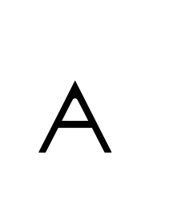
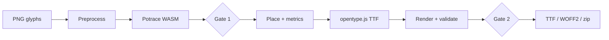

# Font Generator

**Drop PNG letters. Download a real font. Your artwork never uploads.**

[](LICENSE)
[](package.json)
[](package.json)
[](package.json)

An **agentic, browser-native** font builder: PNG glyph art → traced vectors → TTF / WOFF2 / zip. The full conversion pipeline runs client-side in WASM. An optional Claude agent picks parameters, checks its own renders, and asks you to approve at two gates — or skip the agent entirely and generate in one click.

No FontForge install. No accounts. No project database. Refresh and you're done.

<p align="center">
  
  &nbsp;&nbsp;→&nbsp;&nbsp;
  
</p>

<p align="center"><em>Reference glyph <code>A-KaminoDeco.png</code> → open counter, upright on baseline</em></p>

---

## Contents

- [Why this exists](#why-this-exists)
- [Features](#features)
- [Try it in 30 seconds](#try-it-in-30-seconds)
- [How it works](#how-it-works)
- [Three ways to build](#three-ways-to-build)
- [Privacy](#privacy)
- [Agent mode](#agent-mode)
- [Recipe replay](#recipe-replay)
- [Develop & deploy](#develop--deploy)
- [Docs & limitations](#docs--limitations)

---

## Why this exists

| The old way | This app |
|-------------|----------|
| Trace every letter by hand in FontForge / Glyphs | Drop PNGs, get a font |
| Walls of sliders (threshold, turdsize, side bearings…) | Agent picks params; you say "sharper corners" at a gate |
| Desktop-only tooling | Runs in any modern browser |
| "Where did my files go?" | Source PNGs & font bytes stay local — only QA renders hit the model |

Built for lettering artists, logo designers, and type tinkerers who have **images of letters** and want **actual font files** without becoming a font engineer.

---

## Features

- **100% client-side conversion** — preprocess, Potrace trace, place, build, export in WASM/JS
- **AI agent with vision** — Claude (via OpenRouter) tunes params and catches filled counters & baseline bugs
- **Two human gates** — approve trace, then approve render; nudge in plain English
- **No-agent fast path** — one click, pinned recipe, zero API cost
- **Recipe replay** — copy JSON from a run, rebuild later with no model calls
- **Batch upload** — multiple PNGs → one font (A, B, C… by order)
- **Multi-format export** — TTF, WOFF2, zip bundle
- **BYO API key** — bring your own OpenRouter key; never stored
- **Stateless** — no login, no saved projects, HuggingFace-Space vibes

---

## Try it in 30 seconds

```bash
git clone https://github.com/hejijunhao/fontgenerator.git && cd fontgenerator && npm install && npm run dev
```

1. Open `http://localhost:5173`
2. Drop `A-KaminoDeco.png` (included in repo root)
3. Click **Generate (no agent)**
4. Download **KaminoDeco.ttf** or the zip

That's the full pipeline — no API key, no server upload.

---

## How it works



Gates are optional (agent path only). No-agent and recipe replay skip straight through.

---

## Three ways to build

| Path | API key? | Best for |
|------|----------|----------|
| **Generate (no agent)** | No | Quick proof, batch fonts, zero cost |
| **Run agent** | Yes (hosted or BYO) | Hard glyphs, parameter tuning, visual QA |
| **Replay recipe** | No | Reproducing a known-good build |

---

## Privacy

Your **source PNGs and font bytes never leave the browser** for conversion.

In agent mode, only **render previews and agent messages** go to the model through a stateless `/api/agent` proxy — not your original artwork. The proxy logs nothing and stores nothing.

| Local forever | Agent mode only |
|---------------|-----------------|
| Source PNGs | Render previews |
| SVG paths | Agent text |
| Font bytes | — |

---

## Agent mode

Set `OPENROUTER_API_KEY` in `.env.local` (dev) or Vercel env vars (hosted), **or** paste your key under **Agent settings** (per-request, cleared on refresh).

```env
OPENROUTER_API_KEY=sk-or-...
```

- Default model: `anthropic/claude-opus-4.8`
- Cheaper toggle: `anthropic/claude-sonnet-5`
- Hosted proxy rate-limited (30 req/min/IP); BYO-key bypasses the limit

---

## Recipe replay

1. **Copy recipe** after a successful build
2. Upload the same PNGs (same order)
3. Paste JSON → **Replay recipe**

Example: [`tests/fixtures/kamino-deco-recipe.json`](tests/fixtures/kamino-deco-recipe.json)

---

## Develop & deploy

**Node ≥ 20**

```bash
npm run dev           # local app + /api/agent proxy
npm run build         # production build
npm run ci            # build + lint + 27 tests (Vitest + Playwright)
npm run test:e2e      # UI smoke only
```

**Vercel:** static SPA + Edge function at `api/agent/[...path].ts`. Set `OPENROUTER_API_KEY` for hosted agent mode. Config in [`vercel.json`](vercel.json).

**Stack:** React · TypeScript · Tailwind · Zustand · potrace-wasm · opentype.js · wawoff2 · Vercel AI SDK · OpenRouter

---

## Docs & limitations

| Doc | What |
|-----|------|
| [`docs/changelog.md`](docs/changelog.md) | Release history |
| [`docs/proposal.md`](docs/proposal.md) | Vision & scope |
| [`docs/product-blueprint.md`](docs/product-blueprint.md) | Architecture & contracts |
| [`docs/executing/implementation-plan.md`](docs/executing/implementation-plan.md) | Build phases |

**v1 caveats:** TTF master (not CFF OTF); WOFF is a stub; potrace-wasm ignores JS trace tuning; agent is single-glyph (batch via no-agent / replay).

---

## License

[Apache 2.0](LICENSE)

---

<p align="center">If this saves you an afternoon in FontForge, a ⭐ helps the next designer find it.</p>