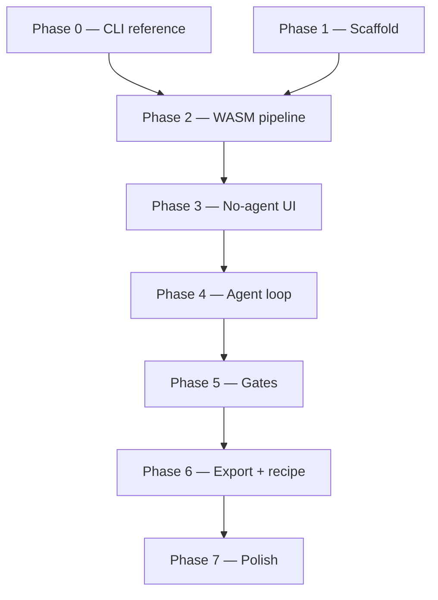

# Implementation Plan

Methodical build guide for the agentic font generator. This is the **execution**
playbook — follow phases in order; do not skip acceptance criteria before moving on.

**Upstream specs (read first, do not duplicate here):**

| Doc | Role |
|-----|------|
| [proposal.md](../proposal.md) | What & why — problem, agentic design, privacy, deferred scope |
| [product-blueprint.md](../product-blueprint.md) | How — tool contracts, data model, agent design, proxy contract |
| [claude-process.md](../claude-process.md) | Reference pipeline — native CLI proof on `A-KaminoDeco.png` |

**Reference asset:** `A-KaminoDeco.png` (cream background, enclosed counter in `A`).

**North-star acceptance test:** a downloadable font where capital `A` has an **open
counter**, sits **upright on the baseline**, and passes structural validation — first
via CLI, then via browser with no agent, then via agent + gates.

---

## How to use this document

1. Work **one phase at a time**. A phase is done only when every item in its
   **Exit checklist** is checked.
2. **Phase 0 is mandatory** — it de-risks winding, baseline, and threshold before any
   TypeScript exists.
3. When a phase lists a **Decision point**, record the choice in the
   [Decision log](#decision-log) at the bottom before continuing.
4. Keep commits scoped to the active phase so bisect/review stays sane.
5. Each phase ends with a short note in the phase's **Handoff** section (what worked,
   pinned params, surprises).

---

## Target repository layout (end state)

```
fontgenerator/
├── A-KaminoDeco.png              # reference glyph (already present)
├── docs/
├── api/
│   └── agent.ts                  # Vercel serverless OpenRouter proxy
├── public/
├── scripts/
│   └── cli-reference/            # Phase 0 — optional reproducible shell scripts
├── src/
│   ├── app/                      # routes / shell
│   ├── components/               # upload, run-view, gates, export
│   ├── pipeline/                 # deterministic tools (preprocess, trace, place, build, validate, export)
│   ├── agent/                    # system prompt, tool wrappers, loop orchestration
│   ├── store/                    # Zustand — Project, GlyphJob, Recipe
│   ├── types/                    # shared TS types from blueprint §3–4
│   └── lib/                      # px→em, winding, metrics helpers
├── tests/
│   ├── unit/                     # Vitest — transform, winding, tool wrappers
│   └── fixtures/                 # A-KaminoDeco.png copy, golden outputs
├── vercel.json
├── package.json
└── vite.config.ts
```

Phases below create these incrementally; do not scaffold everything in Phase 1.

---

## Phase 0 — CLI reference validation

**Goal:** Prove the font math is correct using native tools before writing browser
code. Output becomes the **golden reference** for Vitest and visual comparison.

**Depends on:** `claude-process.md`, `A-KaminoDeco.png`, local install of ImageMagick,
Potrace, FontForge (Python API or CLI), fonttools, optional `ots-sanitize` and
`hb-view`.

### Tasks

| # | Task | Notes |
|---|------|-------|
| 0.1 | Inspect source PNG dimensions | `sips -g pixelWidth -g pixelHeight A-KaminoDeco.png` |
| 0.2 | Preprocess to bilevel PBM | Luminance threshold ~60%; morphology close; **trim horizontal ink only** — keep full canvas height |
| 0.3 | Trace with Potrace | Tune `turdsize`, `alphamax` (keep high), `opttolerance`; export SVG |
| 0.4 | Build single-glyph font via FontForge | Import SVG; px→em with `unitsPerEm=1000`, baseline fraction `b`; `correctDirection()`; assign `U+0041`; synthesize `.notdef` + `space` |
| 0.5 | Export OTF, WOFF, WOFF2 | FontForge `generate()` or fonttools + `woff2_compress` |
| 0.6 | Structural validation | `fonttools ttx KaminoDeco.otf`; `ots-sanitize` on WOFF2 if available |
| 0.7 | Visual validation | `hb-view` or Pillow render of `"A"` — confirm open counter, sharp apex, baseline |
| 0.8 | Pin reference params | Write down threshold, trace knobs, `b`, side bearings into `scripts/cli-reference/params.json` |
| 0.9 | Save golden artifacts | Store `A.svg`, `KaminoDeco.otf`, render PNG under `tests/fixtures/golden/` for later diff |

### Exit checklist

- [ ] Rendered `A` shows **punched counter** (not solid triangle)
- [ ] Glyph is **upright** and sits on **baseline** (`y = 0`)
- [ ] OTF round-trips through `fonttools ttx` without parse errors
- [ ] WOFF2 passes `ots-sanitize` (if tool installed)
- [ ] `params.json` documents every knob used — this is the no-agent default seed

### Handoff

Record: chosen `b`, threshold %, Potrace params, advance width formula, any FontForge
quirks. These feed Phase 2 hardcoded params and Phase 3 UI defaults.

---

## Phase 1 — Project scaffold & deploy

**Goal:** Empty but deployable SPA on Vercel. No pipeline yet.

**Depends on:** Phase 0 complete (or explicitly deferred with pinned params from a
manual CLI run).

### Tasks

| # | Task | Notes |
|---|------|-------|
| 1.1 | `npm create vite@latest` — React + TypeScript | Project root |
| 1.2 | Add Tailwind CSS | Match blueprint stack |
| 1.3 | Add Vitest + jsdom | `vitest.config.ts` |
| 1.4 | Minimal shell UI | Title, placeholder drop zone, "not implemented" state |
| 1.5 | Copy `A-KaminoDeco.png` → `tests/fixtures/` | Test + manual dev use |
| 1.6 | `vercel.json` stub | Prepare for `/api/agent` later; static build only for now |
| 1.7 | Deploy to Vercel | Confirm CDN serves SPA; env vars not required yet |
| 1.8 | CI script | `npm run build && npm test` (tests may be empty/pass) |

### Exit checklist

- [ ] `npm run dev` serves the shell locally
- [ ] `npm run build` succeeds
- [ ] Vercel preview URL loads the placeholder app
- [ ] Vitest runs (even if zero tests)

### Handoff

Vercel project linked; Node version pinned in `package.json` `engines` if needed.

---

## Phase 2 — Deterministic pipeline (WASM tools)

**Goal:** Implement blueprint §3 tools as plain TypeScript functions with unit tests.
No UI wiring, no agent.

**Depends on:** Phase 1; Phase 0 golden outputs.

### Decision point (complete before 2.5)

**Master font format:** opentype.js writes TrueType (`glyf`) robustly; CFF/OTF
writing is limited.

| Option | Recommendation |
|--------|----------------|
| A. TTF master, label download "TTF" (or `.otf` extension with glyf tables) | **Default — ship this unless CFF proof succeeds** |
| B. CFF OTF via opentype.js / fonttools WASM | Only if Milestone 2 spike proves clean write + browser acceptance |

Record choice in [Decision log](#decision-log).

### Tasks

| # | Task | Module | Notes |
|---|------|--------|-------|
| 2.1 | Shared types | `src/types/` | `PreprocessParams`, `TraceResult`, `PlacedGlyph`, `FontMeta`, etc. — mirror blueprint |
| 2.2 | `preprocess(png, params)` | `src/pipeline/preprocess.ts` | Canvas: grayscale → luminance threshold → optional morphology → **horizontal ink crop only**; return bitmap + `inkBounds` + `canvasHeight` + preview data URL |
| 2.3 | Integrate Potrace WASM | `src/pipeline/trace.ts` | e.g. `esm-potrace-wasm`; lazy-load; `trace(bitmap, {turdsize, alphamax, opttolerance})` → SVG paths + preview |
| 2.4 | Geometry helpers | `src/lib/` | `pxToEm`, `flipY`, `computeMetrics`, `fixWinding` / `reverseContour` |
| 2.5 | `place(trace, srcHeight, codepoint, params)` | `src/pipeline/place.ts` | Shared `s = U/H`, baseline `b·H`; Y-flip; winding correction; metrics |
| 2.6 | `buildFont(glyphs, meta)` | `src/pipeline/buildFont.ts` | opentype.js: `.notdef`, `space`, cmap, name, OS/2 vertical metrics from `baselineFraction`, head/post |
| 2.7 | `validate(otf)` | `src/pipeline/validate.ts` | Round-trip parse via opentype.js; collect warnings; optional `ots.js` WASM later |
| 2.8 | `toWoff` / `toWoff2` | `src/pipeline/export.ts` | `wawoff2` WASM; lazy-load |
| 2.9 | `renderSample(otf, text)` | `src/pipeline/render.ts` | Canvas text render via blob URL + `FontFace`, or opentype.js path draw — for tests and later agent vision |
| 2.10 | Vitest suite | `tests/unit/` | **Must pass:** px→em transform known points; winding on `A` contours; full pipeline on `A-KaminoDeco.png` using Phase 0 pinned params; structural `validate` ok |

### Exit checklist

- [ ] `preprocess` → `trace` → `place` → `buildFont` runs in Node/Vitest on fixture PNG
- [ ] Output font renders `A` with **open counter** (compare to Phase 0 golden render)
- [ ] `validate()` reports `roundTripOk: true`
- [ ] `toWoff2()` produces bytes that `validate` accepts
- [ ] Master format decision recorded
- [ ] WASM bundles lazy-load (no massive initial chunk) — verify with `vite build` analyzer or chunk sizes

### Handoff

Export a small `runPipeline(png, recipe)` function that chains all tools — reused by
agent tools and recipe replay in Phase 6.

---

## Phase 3 — No-agent happy path (UI + download)

**Goal:** One glyph, hardcoded recipe params, full browser flow: upload → build →
preview → download. Proves end-to-end without model cost.

**Depends on:** Phase 2.

### Tasks

| # | Task | Notes |
|---|------|-------|
| 3.1 | Zustand store skeleton | `Project` with one `GlyphJob`; ephemeral only |
| 3.2 | Upload component | Drag/drop + file picker; store `sourcePng` blob |
| 3.3 | "Generate" action | Run `runPipeline` with hardcoded params from Phase 0 `params.json` |
| 3.4 | Progress UI | Simple step indicator: preprocess → trace → place → build → export |
| 3.5 | Preview panel | `renderSample` for `"A"`; show validation badges |
| 3.6 | Download button | Single master file (TTF/OTF per decision); filename from `FontMeta.family` |
| 3.7 | Error surfacing | WASM failures show actionable message |

### Exit checklist

- [ ] Drag `A-KaminoDeco.png` → download → install/open font → `A` looks correct
- [ ] No network calls except static assets (verify DevTools Network)
- [ ] Refresh wipes state (no localStorage persistence)
- [ ] Works on Vercel preview deploy

### Handoff

Screenshot or saved render for regression; note any browser-specific Canvas/WASM issues.

---

## Phase 4 — Agent infrastructure

**Goal:** Client-side Vercel AI SDK loop drives pipeline tools; `/api/agent` proxies
OpenRouter; agent completes `A` unattended with vision QA.

**Depends on:** Phase 3 (pipeline stable).

### Tasks

| # | Task | Notes |
|---|------|-------|
| 4.1 | `/api/agent` serverless function | Reverse-proxy `https://openrouter.ai/api/v1/*`; inject `OPENROUTER_API_KEY`; stream SSE; no logging of bodies |
| 4.2 | OpenRouter provider setup | `createOpenRouter({ baseURL: '/api/agent' })` in browser |
| 4.3 | Wrap pipeline fns as AI SDK tools | `tool({ description, inputSchema: zod, execute })` for preprocess, trace, place, buildFont, renderSample, validate |
| 4.4 | Agent-only tools | `assignCharacter`, `requestGate` (stub — auto-accept in 4), `finish` |
| 4.5 | System prompt | Per blueprint §5 — toolchain operator, not font engine; luminance-first; winding checks |
| 4.6 | Loop config | `streamText` / Agent; `stopWhen: stepCountIs(6)`; reasoning `effort: 'high'`; `cacheControl: ephemeral` on system prefix |
| 4.7 | Vision in tool results | Attach `previewPng` as image parts in tool returns |
| 4.8 | Run view UI | Stream agent steps to `GlyphJob.agentLog` |
| 4.9 | `OPENROUTER_API_KEY` on Vercel | Hosted mode works on preview |
| 4.10 | Verify provider options | Confirm `reasoning.effort` and `cache_read` non-zero in usage — log results; document if no-op |

### Exit checklist

- [ ] Upload `A` → Start agent → agent picks params → font builds without human input (gates stubbed to auto-accept)
- [ ] Final font matches no-agent quality (open counter, baseline)
- [ ] `agentLog` records every tool call + params
- [ ] API key absent from client bundle (inspect built JS)
- [ ] Proxy adds auth header only server-side
- [ ] Provider verification note recorded in Decision log

### Handoff

Typical cost per glyph from OpenRouter usage; chosen default model slug; any prompt tweaks.

---

## Phase 5 — Human gates

**Goal:** Replace stub gates with real review UI; natural-language nudges re-run
minimal pipeline stages.

**Depends on:** Phase 4.

### Tasks

| # | Task | Notes |
|---|------|-------|
| 5.1 | App state machine | `empty → uploaded → agent-running → gate1 → … → gate2 → exporting → done` per blueprint §2 |
| 5.2 | `requestGate` implementation | Pauses SDK loop; resolves on user action |
| 5.3 | Gate 1 UI | Original PNG ↔ traced vector overlay; proposed character; **Accept** / **Re-trace** (nudge text) / **Fix character** |
| 5.4 | Gate 2 UI | Sample text in built font; validation badges; **Accept & export** / **Adjust** (nudge) |
| 5.5 | Nudge → param mapping | Agent translates NL to concrete changes (document in system prompt + few-shot examples) |
| 5.6 | Per-glyph Gate 1 for batch | Grid of tiles when multiple glyphs uploaded |
| 5.7 | Cancel / max-iteration guard | Force gate after N tool calls per glyph |

### Exit checklist

- [ ] Re-trace nudge ("sharper corners") produces visibly different trace and recovers on bad first pass
- [ ] Fix character changes codepoint and rebuilds
- [ ] Gate 2 "counter filled" nudge triggers winding re-run path
- [ ] User can complete full flow with **two** human interactions minimum (both gates accept first pass)
- [ ] Reject/nudge loops return to `agent-running`, not a blank state

### Handoff

UX friction notes; default gate copy; any nudge mappings that needed prompt fixes.

---

## Phase 6 — Full export & recipe replay

**Goal:** WOFF/WOFF2 + zip; serializable recipe; agent-free replay.

**Depends on:** Phase 5.

### Tasks

| # | Task | Notes |
|---|------|-------|
| 6.1 | Export panel | Download OTF/TTF master, WOFF, WOFF2, zip (JSZip) |
| 6.2 | `Recipe` type + serializer | Version 1 per blueprint §4 — meta + per-glyph params |
| 6.3 | Log recipe on successful run | From `agentLog` distilled params |
| 6.4 | "Copy recipe" button | JSON to clipboard |
| 6.5 | Replay path | Import recipe → `runPipeline` per glyph, skip agent → export (fast path) |
| 6.6 | Batch assembly | Multiple `PlacedGlyph`s → one `buildFont` at Gate 2 accept |

### Exit checklist

- [ ] Zip contains all three formats (or documented subset per master-format decision)
- [ ] Pasted recipe replay produces byte-identical or visually identical font (document acceptable drift)
- [ ] Fast path completes with **zero** OpenRouter calls
- [ ] Multi-glyph batch (e.g. `A` + `B`) exports single font with correct cmap

### Handoff

Recipe JSON example committed to `tests/fixtures/` for replay test.

---

## Phase 7 — Polish & production hardening

**Goal:** Ship-quality UX, abuse controls, edge cases. v1 complete.

**Depends on:** Phase 6.

### Tasks

| # | Task | Notes |
|---|------|-------|
| 7.1 | Batch upload polish | Thumbnails, remove glyph, partial set warnings |
| 7.2 | Streamed agent narration | Step labels, timing, error recovery copy |
| 7.3 | Partial font warnings | Agent + UI flag missing `space`, `.notdef` ok, missing letters |
| 7.4 | BYO-key mode | User key through proxy per request only; never stored |
| 7.5 | Rate limiting | Per-IP on `/api/agent` for hosted key |
| 7.6 | Privacy copy | Explicit note: renders go to model for QA |
| 7.7 | Sonnet fallback | Cheaper model toggle or auto-fallback |
| 7.8 | Playwright smoke test | Upload → gates ( scripted accept) → download |
| 7.9 | Bundle optimization | Confirm WASM code-split; measure first interaction latency |
| 7.10 | Optional `ots.js` | Browser OTS sanitize if not done in Phase 2 |

### Exit checklist

- [ ] Hosted preview usable by a non-developer following a one-line README
- [ ] Rate limit returns 429 with clear message
- [ ] BYO-key path tested once
- [ ] Playwright smoke passes in CI
- [ ] All blueprint **Non-goals** remain unimplemented (no accounts, kerning UI, etc.)

---

## Cross-cutting concerns (all phases)

### Testing strategy

| Layer | When | What |
|-------|------|------|
| Unit (Vitest) | Phase 2+ | Transforms, winding, metrics, validate |
| Golden visual | Phase 0, 2, 3 | Compare `A` render to fixture PNG (perceptual or pixel diff threshold) |
| Integration | Phase 3+ | Full pipeline on fixture in jsdom/happy-dom with Canvas mock where needed |
| E2E (Playwright) | Phase 7 | Happy path + gate flow |
| Manual | Phase 0, 5 | Font install in macOS Font Book / Windows viewer |

### Privacy & security (verify continuously)

- Font bytes and source PNGs never uploaded for conversion.
- Only agent preview images and text cross the proxy.
- No persistence in proxy; no image logging.
- API key only in Vercel env for hosted mode.

### Performance

- Lazy-load Potrace and wawoff2 WASM on first use.
- Cap preview image dimensions sent to model (e.g. max 512px) — document in agent prompt.
- Recipe replay as zero-cost path.

---

## Phase dependency graph



Phase 1 and Phase 0 can overlap: scaffold while CLI runs, but Phase 2 must not start
until Phase 0 exit checklist passes.

---

## Suggested commit / PR boundaries

| PR | Phases | Title pattern |
|----|--------|---------------|
| 1 | 0 | `chore: cli reference pipeline + golden fixtures` |
| 2 | 1 | `feat: vite react scaffold + vercel deploy` |
| 3 | 2 | `feat: deterministic font pipeline + vitest` |
| 4 | 3 | `feat: no-agent happy path UI` |
| 5 | 4 | `feat: agent loop + openrouter proxy` |
| 6 | 5 | `feat: human review gates` |
| 7 | 6 | `feat: woff2 zip export + recipe replay` |
| 8 | 7 | `feat: polish, rate limits, e2e` |

---

## Decision log

Record decisions here as phases complete. Do not leave implicit.

| Date | Decision | Chosen | Rationale |
|------|----------|--------|-----------|
| 2026-07-01 | Master font format (Phase 2) | **TTF (glyf)** | opentype.js write support |
| 2026-07-01 | Tracer package | **potrace-wasm** | esm-potrace-wasm fails on full-size bitmap |
| 2026-07-01 | Default `unitsPerEm` | 1000 | Blueprint + `params.json` |
| 2026-07-01 | Default baseline fraction `b` | **0.754385** | Phase 0 foot row 946 / canvas 1254 |
| 2026-07-01 | Default preprocess threshold | **0.6** (60% luminance) | Phase 0 CLI |
| 2026-07-01 | Potrace defaults | **turdsize 2, alphamax 1.0, opttolerance 0.2** | Phase 0 CLI; recorded in recipes, not applied by potrace-wasm |
| 2026-07-01 | OpenRouter model default | `anthropic/claude-opus-4.8` | Blueprint default |
| 2026-07-01 | `reasoning.effort` effective? | **Sent (`high`)** — verify `cacheReadTokens` in browser console after first agent run | Logged in `runAgent` `onFinish`; may be no-op per OpenRouter reports |
| 2026-07-01 | Prompt caching effective? | **Configured** (`cacheControl: ephemeral` on system message) — verify non-zero `inputTokenDetails.cacheReadTokens` on 2nd+ step | See RunView usage line |

---

## Definition of done (v1)

The product is **v1 complete** when:

1. A designer can drop PNG letter images, run the agent, approve two gates, and
   download OTF/TTF + WOFF + WOFF2 (and zip).
2. `A-KaminoDeco.png` works end-to-end with correct counter, orientation, and baseline.
3. Recipe copy + replay works without further model calls.
4. Stateless: refresh clears all state; no accounts or database.
5. Privacy statement visible; conversion stays local; only QA renders hit the model.
6. Hosted deploy on Vercel with rate-limited proxy.

Everything in [proposal.md](../proposal.md) *Explicitly deferred* remains out of scope.