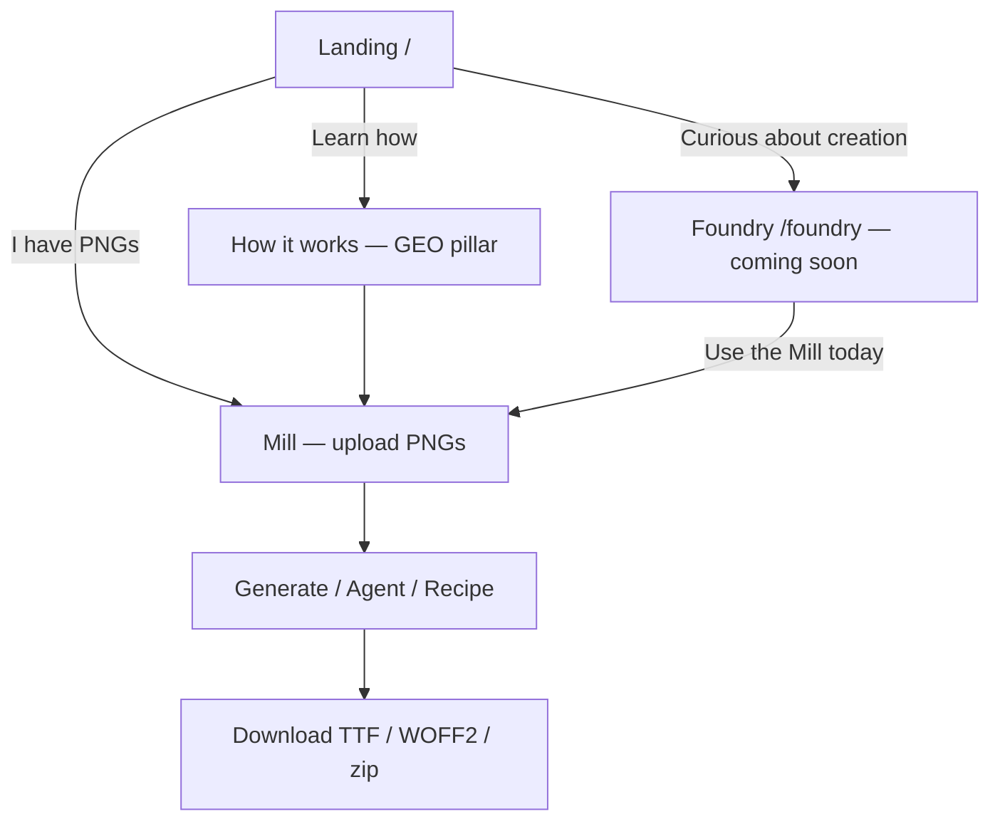

# Platform Evolution Proposal — Glyphmill v2

**Status:** Approved (scope revised 2026-07-02; design + GEO addendum 2026-07-02)  
**Date:** 2026-07-02  
**Author:** Platform planning (post–v1 completion)

**Context:** v1 shipped a capable **Mill** — PNG glyphs in, real fonts out, with optional agentic
parameter tuning. This document defines the **v2.0 ship scope**: structural polish, a proper landing
page, platform framing (Foundry + Mill), a **dual-surface design** adapted from the Kamino console
system, and **GEO/SEO hygiene** so the product is discoverable by humans and AI answer engines.
Full **Foundry** functionality (agentic glyph *creation* via image generation) is designed here but
**deferred** — the Foundry route ships as a coming-soon placeholder until image gen is tackled later.

**Upstream docs:**

| Doc | Role |
|-----|------|
| [proposal.md](../proposal.md) | Original v1 vision |
| [product-blueprint.md](../product-blueprint.md) | v1 build spec |
| [implementation-plan.md](./implementation-plan.md) | v1 execution (complete) |
| [v2-implementation-plan.md](./v2-implementation-plan.md) | **v2 execution playbook** — phases, tasks, exit checklists |
| [kamino-design.md](./kamino-design.md) | Kamino console design contract — monument vs engine room |
| [geo-best-practices.md](./geo-best-practices.md) | GEO + SEO agent checklist for discoverability |

---

## 1. Executive summary

### v2.0 — ship now

Glyphmill presents as a **two-chamber type workshop**, even while Foundry is not yet built:

| Chamber | Job | v2.0 status |
|---------|-----|-------------|
| **Foundry** | Invent letterforms — explore styles, generate glyphs, iterate with an agent | **Placeholder** (`/foundry` — coming soon) |
| **Mill** *(today's Studio)* | Convert artwork into installable fonts — trace, place, export | **Full product** (polished console UI at `/mill`) |

**v2.0 deliverables:**

1. **Landing page** at `/` — answer-first hero, proof strip, two-chamber story, CTAs to Mill.
2. **Information architecture** — path-based routes, nav, per-page layout, Studio → **Mill** in copy.
3. **Dual-surface design** — **Monument** surfaces (landing, how-it-works) + **Console** surface (Mill);
   adapted from [kamino-design.md](./kamino-design.md), not a full Kamino re-skin in one pass.
4. **Mill polish** — instrument bays, staged sections, pipeline readouts, step indicator, micro-UX.
5. **Foundry placeholder** — on-brand coming-soon page (Kamino "inert/hatched" treatment).
6. **How it works updates** — GEO-structured explainer; two-chamber narrative; Foundry upcoming.
7. **Discoverability layer** — `robots.txt`, `llms.txt`, per-page meta, JSON-LD, prerendered pillar HTML.

**Polish scope:** evolve the product shape and discoverability; no accounts DB, no kerning editors,
no image generation. Design adoption is **principled and phased** — console grammar on the Mill,
monument posture on marketing pages — not a wholesale token swap on day one.

### Later — Foundry implementation

The full Foundry spec (§10) remains the north star for a follow-on phase. Image gen, variation grids,
and Foundry-specific rate limits are **out of v2.0 scope**.

### Positioning

Long-term:

> **Sketch letterforms in the Foundry. Mill them into real fonts.**

v2.0 honest one-liner (also the `llms.txt` blockquote candidate):

> **Glyphmill is a browser-native tool that turns PNG letter art into installable TTF and WOFF2
> fonts. Conversion runs locally in WASM; an optional agent tunes parameters. Foundry — agentic
> glyph creation — is coming soon.**

---

## 2. Resolved decisions

| # | Topic | Decision |
|---|-------|----------|
| 1 | Chamber naming | **Foundry + Mill** — approved pair |
| 2 | Default route | **`/` = Landing**; Mill at **`/mill`** |
| 3 | Foundry image gen | **Deferred** — Foundry page is a coming-soon placeholder in v2.0 |
| 4–6 | Generation strategy, image model, charset, gates | **Deferred** with Foundry implementation |
| 7 | Auto family naming from style brief | **Nice idea — defer** |
| 8–11 | Share links, specimen branding, rate limits, legal | **Deferred** |
| 12 | Priority | **P1 → P2 → P3 → P4** (see [v2-implementation-plan.md](./v2-implementation-plan.md)) |
| 13 | Routing for GEO | **Path-based URLs** preferred over hash-only (`/mill` not `#/mill`) — see §8 |
| 14 | Design system | **Dual-surface** (Monument + Console) per Kamino — Mill gets console treatment in P2 |

---

## 3. Current state (honest audit)

### What works

- **Technical credibility:** client-side Potrace → opentype.js → WOFF2 is rare and verifiable.
- **Honest positioning:** How it works page correctly separates math from model judgment.
- **Three build paths:** no-agent, agent, recipe replay — each has a clear cost story.
- **Design system:** semantic tokens, shared `.panel` / `.btn-*` classes, dark mode — cohesive baseline.
- **Stateless privacy story:** conversion local; only QA renders hit the proxy (agent mode).

### What v2.0 fixes

| Gap | v2.0 fix |
|-----|----------|
| **No landing / hero moment** | New `/` landing with proof strip and CTAs |
| **Single-page Studio** | Mill staged into Source → Build → Review → Export |
| **"Studio" naming** | User-facing **Mill**; code may keep `StudioView` internally |
| **Max width `3xl` everywhere** | Per-route `PageShell`; console uses full-bleed bay grid on Mill |
| **Platform story incomplete** | Foundry nav + placeholder; two-chamber copy |
| **Tool UI reads as dashboard** | Kamino console grammar on Mill — bays, mono readouts, pipeline instrument |
| **Invisible to AI search** | `robots.txt`, `llms.txt`, structured content, prerendered pillar pages |
| **Hash-only routing** | Path-based routes + SPA fallback (crawler-friendly URLs) |

### What remains for later

| Gap | When |
|-----|------|
| Entry requires existing PNGs | Foundry implementation |
| Agent only tunes conversion | Foundry implementation |
| Share artifacts | Future |
| Full Kamino console (left rail, DAG animation, metric reels) | Incremental post–v2.0 |

### Structural inventory (today → v2.0)

```
Today:
#/              → StudioView
#/how-it-works  → HowItWorksView

v2.0:
/               → LandingView          NEW (Monument)
/foundry        → FoundryPlaceholder   NEW (Monument, inert)
/mill           → StudioView           Console
/how-it-works   → HowItWorksView       Monument + GEO pillar
```

**Breaking change:** `/` is no longer the Mill. Document in changelog. Optional redirect:
`/studio` → `/mill` for old bookmarks if we ever exposed that path.

---

## 4. Proposed platform shape (v2.0)

### 4.1 Information architecture

```
┌─────────────────────────────────────────────────────────────┐
│  Header: GLYPHMILL · Foundry · Mill · How it works · Theme  │
├─────────────────────────────────────────────────────────────┤
│                                                             │
│   Route          Surface    Purpose                v2.0     │
│   ─────          ────────    ───────                ────     │
│   /              Monument   Landing, hero, CTA      SHIP     │
│   /foundry       Monument   Coming soon teaser    SHIP     │
│   /mill          Console    Conversion pipeline   SHIP     │
│   /how-it-works  Monument   GEO pillar / FAQ      UPDATE   │
│                                                             │
└─────────────────────────────────────────────────────────────┘
```

- **Logo click → Landing** (`/`), not Mill.
- **Nav order:** Foundry · Mill · How it works.
- **Foundry nav:** links to placeholder; **"Soon"** badge using Kamino inert/hatched treatment (§6.4).

### 4.2 User journeys (v2.0)



**Journey A — primary:** Landing → Mill → drop PNGs → generate → download.

**Journey B — discoverability:** AI search / Google → How it works → Mill.

**Journey C — future:** Landing → Foundry → generate glyphs → Send to Mill → download.

### 4.3 Internal linking (hub-and-spoke)

Per [geo-best-practices.md](./geo-best-practices.md) §6 — no orphan pages, descriptive anchors:

| Pillar | Spokes link in with… |
|--------|----------------------|
| **Landing** (`/`) | "how Glyphmill converts PNGs to fonts", "open the Mill", "Foundry (coming soon)" |
| **How it works** (`/how-it-works`) | "try the Mill", "A-KaminoDeco demo", "browser font pipeline" |
| **Mill** (`/mill`) | "read how it works", "privacy: what stays local" |
| **Foundry** (`/foundry`) | "use the Mill today", "two-chamber workflow" |

Every page reachable within **2 clicks** from `/`.

---

## 5. Dual-surface design (Kamino adaptation)

[kamino-design.md](./kamino-design.md) defines two postures for Kamino products:

| Posture | Kamino name | Glyphmill surfaces | Feel |
|---------|-------------|-------------------|------|
| **Monument** | Marketing website — "a thing you stand before" | Landing, How it works, Foundry placeholder | Warm, readable, proof-led; prose-first |
| **Console** | Engine room — "a thing you work inside" | Mill (Foundry tool, when built) | Warm-obsidian instrument bridge; data-first |

**The grayscale test applies to the Mill:** desaturate the console UI — it should still read as a
structured instrument (bays, hairlines, mono readouts), not a generic dark SaaS template.

### 5.1 What we adopt in v2.0 (practical subset)

Do **not** attempt a full Kamino port (left command rail, DAG packet animation, metric reels) in
v2.0. Adopt the **structural signature** (Kamino §2) where it earns clarity:

| Kamino rule | Glyphmill v2.0 application |
|-------------|---------------------------|
| **Square = built, round = alive** | Mill panels/bays are square; buttons, status pills, live agent dot are round |
| **Mono = data, Sans = prose** | Mono: recipe JSON, agent log, step labels, metrics, thresholds, codepoints. Sans: descriptions, gate copy, privacy prose |
| **Instrument bays** | Replace `.panel` rounded cards on Mill with recessed square bays (hairline border, subtle inset lip) |
| **Readout labels** | Mill stage headers use mono uppercase kickers: `SOURCE`, `BUILD`, `REVIEW`, `EXPORT` |
| **Pipeline instrument** | `ProgressSteps` evolves toward a horizontal node graph — preprocess → trace → place → build → export; active step gets round live dot + signal edge tick |
| **Status pills** | Agent running, gate waiting, error: glyph + label (`● RUNNING`, `■ FAILED`) — legible without colour |
| **Honest empty/loading** | WASM warm-up: glyph mark + mono label ("warming up the mill…"), not a generic spinner; errors hold steady, don't pulse |
| **No marketing voice in console** | Mill UI: nouns and short verbs; no exclamation marks |
| **Coming soon = inert** | Foundry placeholder + nav badge: ghost ring + hatched fill (Kamino §5.7 disabled/pending) |
| **One signal, seldom** | One primary action per Mill zone (`Generate`, `Run agent`, `Download`); accent on that button only |

### 5.2 Monument surfaces (landing, how-it-works)

Keep the existing **cream/ink** warm palette — it is already monument-adjacent (Kamino marble DNA).
Refinements:

- **Answer-first hero** — lead with what Glyphmill *is*, not brand fluff (aligns with GEO §4.1).
- **Proof strip** — before/after with explicit `width`/`height` on images (CLS); WebP where practical.
- **Carved, not glowing** — no gradient heroes, no neon; structure and type carry hierarchy.
- **Registration band** — optional hairline tick divider under section headers (light Kamino nod).
- Typography: Inter is fine for v2.0 Monument; consider IBM Plex later for full Kamino alignment.

### 5.3 Console surface (Mill)

Mill adopts a **dark-first console theme** (warm obsidian ground per Kamino §9.1), while Monument
pages keep light-default + existing theme toggle. Options:

| Approach | Recommendation |
|----------|----------------|
| A. Mill always dark console | **Preferred** — clear posture split; theme toggle hidden on `/mill` |
| B. User toggle applies everywhere | Simpler but blurs monument/console distinction |

**Console tokens (new `src/lib/consoleTheme.css` or token layer):**

```
--ground:     #0D0C0B
--panel:      #161513
--text:       #ECEAE6
--text-soft:  #B7B3AC
--hairline:   rgba(236, 234, 230, 0.10)
--signal:     TBD — Glyphmill accent (ink/cream invert or dedicated crimson)
--state-ok:   #5E8C73   /* validation pass */
--state-warn: #C8923E   /* partial font warning */
--state-fail: #C9514B   /* pipeline error — distinct from brand signal */
```

Measured field grid on Mill shell background only (8px minor / 64px major at low alpha) — the
factory floor under the bays. Grid hidden on mobile (Kamino §4.3).

### 5.4 Layout tiers

| Tier | Max width | Used for |
|------|-----------|----------|
| **Monument column** | `max-w-3xl` – `max-w-5xl` | Landing prose, FAQ |
| **Console shell** | full-bleed | Mill — bays cap their own content (~76ch for prose bays) |
| **Wide monument** | `max-w-6xl` | Landing proof strip, two-chamber cards |

`App.tsx` today hard-codes `max-w-3xl` — replace with per-route `PageShell` + console shell variant.

### 5.5 Landing page (`/`)

Monument surface. GEO-structured (§7):

1. **Quick Answer** (first 200 words) — numbered, ≤15 words per item, no hype.
2. **Hero** — definition lead: *"Glyphmill is a browser tool that converts PNG letter images into
   installable fonts."* + CTAs (`Open Mill` · `How it works`).
3. **Proof strip** — `A-KaminoDeco.png` → rendered `A` with caption citing open counter + baseline.
4. **Two chambers** — Mill (live) · Foundry (coming soon, hatched).
5. **Comparison table** — Glyphmill vs manual FontForge (HTML `<table>` — AI-extractable).
6. **30-second loop** — HowTo steps: upload → generate → download.
7. **Footer CTA** + link to How it works.

### 5.6 Foundry placeholder (`/foundry`)

Monument surface, inert state:

- Headline + honest "not yet available" copy.
- Static wireframe mock of future brief + grid (CSS).
- Primary CTA: **Use the Mill today** → `/mill`.
- Nav pill: `Soon` with hatched/disabled styling.

### 5.7 Mill page restructuring

Console surface. Staged **instrument bays**:

| Bay | Kicker | Components |
|-----|--------|------------|
| **1 · Source** | `SOURCE` | `DropZone`, `GlyphGrid` |
| **2 · Build** | `BUILD` | actions, `MillStepIndicator`, `ProgressSteps` / pipeline graph, `RunView`, gates; `AgentSettings` in nested bay |
| **3 · Review** | `REVIEW` | `PreviewPanel`, `PartialFontWarning` |
| **4 · Export** | `EXPORT` | `ExportPanel` |

`MillStepIndicator` — horizontal registration ticks between four stages; active stage: round live
dot + 2px signal edge tick (Kamino rail marker pattern).

### 5.8 Micro-polish checklist (v2.0)

- **Empty states:** glyph mark + mono readout label (Mill); hatched Foundry frame.
- **Toasts** for copy-recipe and download — square notification bay, not floating candy.
- **WASM loading** — "warming up the mill…" with honest byte note (~1.2 MB).
- **`prefers-reduced-motion`** — freeze pulses on agent live dot and step transitions.
- **Per-page meta** — see §7 (not just `index.html` defaults).

---

## 6. How it works — GEO content architecture

Revise [HowItWorksView.tsx](../../src/views/HowItWorksView.tsx) as the **cornerstone pillar page**
(AI citation target). Per [geo-best-practices.md](./geo-best-practices.md):

### 6.1 Page structure (answer-first)

1. **Version block** at top: `Last updated: July 2026` + one-line scope note.
2. **Quick Answer** (≤5 bullets, first 200 words) — what Glyphmill does, local vs server, three paths.
3. **H1:** e.g. *"How does Glyphmill turn PNG images into fonts?"*
4. **Two chambers** — Foundry (coming soon) + Mill (live); definition-lead sentences per chamber.
5. **Five pipeline stages** — existing content, reframed with question H2s:
   - *"What happens during preprocessing?"* etc.
6. **Comparison table** — no-agent vs agent vs recipe replay (quantitative: cost, API, speed).
7. **Glyphmill vs FontForge** — HTML table (extractable by AI for "alternative to FontForge" queries).
8. **Methodology** — how `A-KaminoDeco.png` validates the pipeline (Phase 0 CLI reference); pins
   threshold `0.60`, baseline `0.754385`, Potrace defaults.
9. **FAQ** — expand to 10–12 items; each answer **50–100 words**; questions mirror natural AI queries:
   - "How do I make a font from images without FontForge?"
   - "Does Glyphmill use AI to generate letter shapes?"
   - "What file formats does Glyphmill export?"
10. **CTA** — Open Mill.

### 6.2 Voice rules (GEO §4.3)

- Replace superlatives with specifics: "27 automated tests", "client-side WASM", "two human gates",
  "~1.2 MB wawoff2 chunk on first load".
- No "revolutionary", "game-changer", "magic" — the existing honest voice is already GEO-aligned;
  keep it.

### 6.3 JSON-LD (`@graph` per page)

How it works page ships:

- `FAQPage` — must match visible FAQ exactly.
- `HowTo` — upload → generate → download path.
- `SoftwareApplication` — `name`, `applicationCategory`, `operatingSystem: "Web"`, `offers` (free tier).
- `BreadcrumbList` — Home → How it works.

Landing page ships:

- `Organization` + `WebSite` + `SoftwareApplication`.

Inject via `src/components/JsonLd.tsx` or static blocks in prerendered HTML.

---

## 7. Discoverability & technical SEO (GEO layer)

SPA caveat: [geo-best-practices.md](./geo-best-practices.md) §1.6 warns AI crawlers may not execute
JS. Hash routes (`#/mill`) are also invisible as distinct URLs. **v2.0 mitigations:**

### 7.1 Path-based routing (P1)

Migrate from hash routing to **History API** paths:

```
/  /foundry  /mill  /how-it-works
```

`vercel.json` SPA fallback: all paths → `index.html`. Each route is a real URL for crawlers and sharing.

### 7.2 Prerendered pillar HTML (P1 or P4)

At build time, emit static HTML snapshots for **`/`** and **`/how-it-works`** (vite prerender plugin
or lightweight custom script). React hydrates on top. Ensures Quick Answer + FAQ exist in raw HTML for
GPTBot/ClaudeBot/PerplexityBot even if they don't execute JS.

### 7.3 `public/robots.txt` (P1)

Explicit allow rules for AI crawlers (GPTBot, ClaudeBot, Google-Extended, PerplexityBot, CCBot, etc.)
per geo checklist §1.1. Point to sitemap.

### 7.4 `public/llms.txt` (P1)

Curated AI discovery map. Example shape:

```markdown
> Glyphmill converts PNG letter images into installable TTF and WOFF2 fonts in the
> browser. Conversion runs client-side in WASM. Optional Claude agent tunes trace parameters.
> Foundry (agentic glyph creation) is coming soon.

## Core pages
- https://glyphmill.example/ — product overview and demo CTA
- https://glyphmill.example/how-it-works — full pipeline FAQ and methodology
- https://glyphmill.example/mill — the font conversion tool

## Deferred
- /foundry — agentic glyph creation (not yet available)
```

Update when Foundry ships.

### 7.5 `public/sitemap.xml` (P1)

List `/`, `/how-it-works`, `/mill`, `/foundry`. `lastmod` on how-it-works when revised.

### 7.6 Per-page `<head>` (P1)

Use `react-helmet-async` or a small `usePageMeta(route)` hook. Each route gets unique:

| Route | Title (≈55 chars) | `og:type` |
|-------|-------------------|-----------|
| `/` | Glyphmill — PNG letter images to installable fonts | `website` |
| `/how-it-works` | How Glyphmill turns PNG images into fonts | `article` |
| `/mill` | Mill — convert PNG glyphs to TTF / WOFF2 | `website` |
| `/foundry` | Foundry — agentic glyph creation (coming soon) | `website` |

- Meta description: 150–160 chars, answer-first (GEO §3.2).
- `og:image`: **per-page** images ≥1200×630 (landing: before/after composite; how-it-works: pipeline
  diagram). Do not reuse one image everywhere.
- `canonical` absolute URL per route.
- `article:modified_time` on how-it-works.

### 7.7 Performance (Core Web Vitals)

Existing WASM code-split is good. Additional:

- `width`/`height` on proof-strip images (CLS).
- `font-display: swap` on Inter (already loaded — verify preload of weight 400/500/600).
- Lazy-load below-fold landing images.
- Mill console theme: avoid loading Google Fonts twice; subset if switching to Plex later.

---

## 8. Technical architecture (v2.0)

### 8.1 Repository layout

```
public/
├── robots.txt                   # NEW
├── llms.txt                     # NEW
├── sitemap.xml                  # NEW
└── og/                          # NEW — per-route OG images

src/
├── views/
│   ├── LandingView.tsx          # NEW — Monument
│   ├── FoundryPlaceholderView.tsx  # NEW — Monument, inert
│   ├── StudioView.tsx           # Mill — Console
│   └── HowItWorksView.tsx       # UPDATE — GEO pillar
├── components/
│   ├── layout/
│   │   ├── PageShell.tsx        # Monument vs Console variants
│   │   ├── MillStepIndicator.tsx
│   │   └── JsonLd.tsx
│   └── console/                 # NEW — Bay, ReadoutLabel, StatusPill, PipelineGraph
├── lib/
│   ├── navigation.ts            # path-based routes
│   ├── pageMeta.ts              # titles, descriptions, OG per route
│   └── consoleTheme.css         # Kamino console tokens (Mill only)
└── App.tsx
```

**Not in v2.0:** `src/foundry/`, `foundryStore`, image-gen APIs.

### 8.2 Routing

```ts
type AppRoute = 'landing' | 'foundry' | 'mill' | 'how-it-works'

// react-router or thin history wrapper — paths, not hashes
```

### 8.3 API / proxy

No changes — existing `/api/agent` for Mill agent mode only.

### 8.4 Testing

| Layer | Coverage |
|-------|----------|
| Unit | `navigation.ts`, `pageMeta.ts` |
| E2E | `/` → `/mill` nav; Mill smoke at `/mill` |
| GEO smoke | `robots.txt` and `llms.txt` return 200; prerendered HTML contains FAQ text |
| Manual | Lighthouse on `/` and `/how-it-works`; console Mill in dark theme |

---

## 9. Phased delivery plan (v2.0)

| Phase | Name | Deliverable |
|-------|------|-------------|
| **P1** | IA + discoverability | Path routes; `PageShell`; `LandingView` (Monument, Quick Answer); nav; `robots.txt`, `llms.txt`, `sitemap.xml`; per-page meta; prerender `/` + `/how-it-works`; JSON-LD on landing |
| **P2** | Console Mill | Kamino console tokens; instrument bays; mono readouts; `MillStepIndicator`; pipeline graph; status pills; staged bays; toasts; WASM loading state; dark console on `/mill` |
| **P3** | Foundry placeholder | `FoundryPlaceholderView` (hatched inert); nav Soon badge |
| **P4** | GEO pillar | How it works full rewrite (§6); comparison tables; methodology; expanded FAQ + `FAQPage`/`HowTo` schema; per-route OG images; E2E + changelog |

**Ship order:** P1 → P2 → P3 → P4. P3 and P4 can overlap (placeholder is independent of FAQ rewrite).

**First PR:** P1 — routing + landing + `robots.txt`/`llms.txt` — positioning and discoverability
with zero backend risk.

### Effort note

P2 (console design) is the largest visual diff. If timeboxed, minimum viable console: square bays +
mono kickers + dark Mill theme, deferring pipeline graph animation to a fast follow.

---

## 10. Foundry — future implementation (deferred)

Preserves design intent for when image generation is tackled. Nothing here ships in v2.0.

### 10.1 Problem

Mill: *"How do I turn these drawings into a font?"*  
Foundry: *"What should the drawings look like?"*

### 10.2 Planned scope

| In scope | Out of scope |
|----------|--------------|
| Text-to-glyph image generation | Vector editing |
| Style presets + reference image | Manual Bézier UI |
| Charset selection | Color fonts |
| Variation grid + NL nudges | Accounts / galleries |
| Export on shared capture frame | LoRA training |
| Handoff → Mill | Inpainting canvas (v2.1) |

### 10.3 Planned UX

`brief → generate → curate → export → Send to Mill`

### 10.4 Planned agent (separate from Mill)

`generateGlyph`, `generateVariation`, `critiqueSet`, `composeSheet` — sheet+slice preferred for cost.

### 10.5 Capture frame contract

Canvas 1024×1280; `b = 0.754385`; cream `#EEEDE6`; ink `#1A1A18`.

### 10.6 Design note

When Foundry ships, it is a **Console** surface (same grammar as Mill), not Monument.

### 10.7 Post–v2.0 phases

F0 spike → F1 MVP → F2 agent → F3 hardening. Share mechanics remain deferred.

---

## 11. Success metrics (v2.0)

| Signal | Target |
|--------|--------|
| Landing → Mill click-through | >40% of new sessions |
| Mill → download completion | unchanged or improved |
| Organic / AI referral traffic | baseline after 90 days (GEO is long-cycle) |
| `llms.txt` + prerender valid | pillar HTML contains FAQ; no crawler blocks |
| Lighthouse Performance on `/` | LCP ≤ 2.5s on 4G lab |

---

## 12. Risks & mitigations

| Risk | Mitigation |
|------|------------|
| `/` bookmark break | Changelog; prominent Open Mill CTA |
| Foundry teaser over-promises | Inert/hatched styling; honest copy; no dates |
| Console retheme too large | Phased P2; MVP = bays + mono + dark shell |
| SPA invisible to crawlers | Path routes + prerender pillar pages |
| FAQ schema mismatch | JSON-LD mirrors visible FAQ exactly |
| Kamino + Glyphmill identity clash | Glyphmill keeps its wordmark; adopts console *grammar*, not Kamino emblem |
| Scope creep into image gen | Hard boundary §1; Foundry static only in v2.0 |

---

## 13. What we are not doing

**v2.0:**

- Foundry image generation or agent
- Share links, specimen PNG export
- Auto font family naming
- Full Kamino port (left rail, DAG packets, metric reels, IBM Plex migration)
- New backend endpoints
- v1 non-goals unchanged (accounts, kerning UI, etc.)

**Ever:**

- Potrace replaced by model-generated SVG
- Marketing hype voice on console surfaces
- Glow/neon/chartjunk on Mill (Kamino no-go list)

---

## 14. Summary

**v2.0** turns Glyphmill into a **discoverable, platform-shaped product**:

```
Monument (/, /how-it-works, /foundry)  →  explain, prove, entice
Console (/mill)                         →  work, measure, export
GEO layer (robots, llms, prerender, schema) →  humans + AI engines find us
```

```
v2.0:   Landing → Mill (PNG → font → download)
later:  Landing → Foundry (sketch) → Mill (convert) → download
```

The Mill stays the technical differentiator. Kamino console grammar makes it feel like a serious
instrument. GEO hygiene makes the honest story citeable.

---

## Appendix A — open items (Foundry only)

Revisit when Foundry implementation starts:

- Image model and generation strategy (sheet vs per-glyph)
- Charset scope for Foundry MVP
- Human approval gate before Mill handoff
- Hosted quota vs BYO-key for image calls
- Acceptable-use copy for generated artwork
- `--signal` colour token for Glyphmill console (platform-specific Kamino re-skin)

## Appendix B — GEO agent checklist (v2.0 ship gate)

Quick gate before calling v2.0 done — derived from [geo-best-practices.md](./geo-best-practices.md) §10:

**Technical**
- [ ] AI crawlers allowed in `robots.txt`
- [ ] `llms.txt` at domain root
- [ ] Path-based URLs with SPA fallback
- [ ] Prerendered HTML for `/` and `/how-it-works` contains Quick Answer + FAQ text
- [ ] `sitemap.xml` lists all routes

**Head / Meta**
- [ ] Unique title + description per route
- [ ] Unique `og:image` per route (absolute URL, ≥1200×630)
- [ ] `canonical` on each route

**Schema**
- [ ] `SoftwareApplication` on landing
- [ ] `FAQPage` + `HowTo` on how-it-works (content matches visible page)

**Content**
- [ ] Single `<h1>` per page
- [ ] Quick Answer in first 200 words on landing and how-it-works
- [ ] Comparison table on how-it-works
- [ ] Visible last-updated date on how-it-works
- [ ] FAQ answers 50–100 words each

**Design**
- [ ] Mill passes Kamino grayscale test (structure legible desaturated)
- [ ] Foundry uses inert/hatched coming-soon treatment
- [ ] `prefers-reduced-motion` respected on console animations