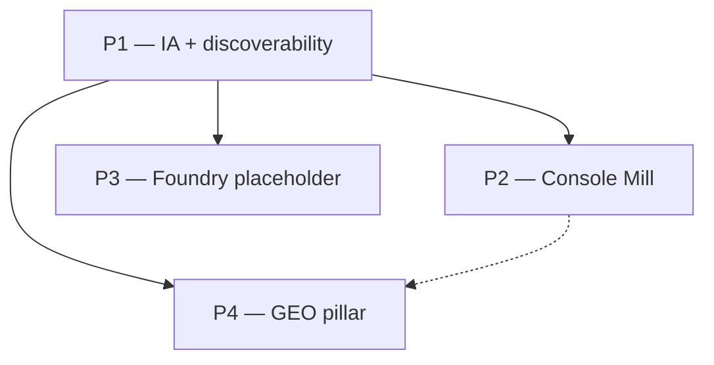

# v2 Implementation Plan — Platform Evolution

Methodical build guide for Glyphmill v2.0. Follow phases **in order**; do not skip exit
checklists before moving on.

**Upstream specs (read first, do not duplicate here):**

| Doc | Role |
|-----|------|
| [platform-evolution-proposal.md](./platform-evolution-proposal.md) | Approved v2 scope — IA, design, GEO, phases |
| [kamino-design.md](./kamino-design.md) | Console design contract — monument vs engine room |
| [geo-best-practices.md](./geo-best-practices.md) | GEO/SEO checklist — robots, llms, content shape |
| [implementation-plan.md](./implementation-plan.md) | v1 execution (complete) |

**North-star acceptance test:** a first-time visitor lands on `/`, understands what Glyphmill
does within 10 seconds, opens `/mill`, drops `A-KaminoDeco.png`, downloads `KaminoDeco.ttf` — with
all 27+ tests green and the Appendix B GEO ship gate checked.

**Breaking change:** `/` becomes the landing page, not the Mill. Mill moves to `/mill`.

---

## How to use this document

1. Work **one phase at a time**. A phase is done only when every item in its **Exit checklist**
   is checked.
2. When a phase lists a **Decision point**, record the choice in the
   [Decision log](#decision-log) before continuing.
3. Keep commits scoped to the active phase so bisect/review stays sane.
4. Each phase ends with a short note in **Handoff** (what worked, surprises).
5. **P3 and P4 may overlap** after P2 is stable — but P1 must complete before P2.

---

## Target repository layout (v2 end state)

```
fontgenerator/
├── public/
│   ├── robots.txt                 # P1 — AI crawler allows
│   ├── llms.txt                   # P1 — curated AI discovery map
│   ├── sitemap.xml                # P1
│   └── og/                        # P4 — per-route OG images (1200×630)
├── src/
│   ├── views/
│   │   ├── LandingView.tsx        # P1 — Monument
│   │   ├── FoundryPlaceholderView.tsx  # P3 — Monument, inert
│   │   ├── StudioView.tsx         # P2 — Mill console layout
│   │   └── HowItWorksView.tsx     # P4 — GEO pillar
│   ├── components/
│   │   ├── layout/
│   │   │   ├── PageShell.tsx      # P1 — Monument vs Console shell
│   │   │   ├── MillStepIndicator.tsx  # P2
│   │   │   └── JsonLd.tsx         # P1 landing; P4 how-it-works
│   │   ├── console/               # P2
│   │   │   ├── Bay.tsx
│   │   │   ├── ReadoutLabel.tsx
│   │   │   ├── StatusPill.tsx
│   │   │   └── PipelineGraph.tsx
│   │   ├── AppHeader.tsx          # P1 — Foundry · Mill · How it works
│   │   ├── AppNavLink.tsx         # P1 — Soon badge for Foundry
│   │   └── … (existing Mill components, restyled in P2)
│   ├── lib/
│   │   ├── navigation.ts          # P1 — path-based routes
│   │   ├── pageMeta.ts            # P1 — per-route head tags
│   │   └── consoleTheme.css       # P2 — Kamino console tokens
│   ├── hooks/
│   │   ├── useAppRoute.ts         # P1 — pathname, not hash
│   │   └── usePageMeta.ts         # P1
│   └── App.tsx                    # P1 — route switch + shells
├── tests/
│   ├── unit/navigation.test.ts    # P1
│   └── e2e/smoke.spec.ts          # P1/P2 — `/mill` paths
└── vercel.json                    # already has SPA rewrite — verify P1
```

**Not in v2.0:** `src/foundry/`, `foundryStore`, image-gen APIs, react-router unless chosen at
decision point.

---

## Phase dependency graph



P3 only needs P1 (Monument shell + nav). P4 benefits from P2 console naming in cross-links but
can proceed in parallel with P3.

---

## Phase 1 — IA, routing & discoverability

**Goal:** Path-based multi-page app with landing, GEO static files, per-page meta, and prerendered
pillar HTML. Zero changes to pipeline/agent logic.

**Depends on:** v1 complete (current `master`).

### Decision point (complete before 1.4)

**Router implementation:**

| Option | Recommendation |
|--------|----------------|
| A. Thin History API wrapper (extend `useAppRoute`) | **Default** — no new dependency; matches current hook pattern |
| B. `react-router-dom` | Use if team prefers standard routing; slightly more boilerplate |

Record choice in [Decision log](#decision-log).

**Production canonical URL** for `llms.txt`, `sitemap.xml`, and `canonical` tags — pin deploy
domain (Vercel preview vs production). Use env `VITE_SITE_URL` or similar.

### Tasks

| # | Task | Module / file | Notes |
|---|------|---------------|-------|
| 1.1 | Extend `AppRoute` type | `src/lib/navigation.ts` | `'landing' \| 'foundry' \| 'mill' \| 'how-it-works'`; map pathname ↔ route |
| 1.2 | Path-based `routeHref`, `routeLabel` | `navigation.ts` | `/`, `/foundry`, `/mill`, `/how-it-works`; remove hash prefixes |
| 1.3 | Rewrite `useAppRoute` | `src/hooks/useAppRoute.ts` | Listen to `popstate`; `pushState` on nav click; parse `location.pathname` |
| 1.4 | Intercept `<a href>` internal nav | `AppNavLink.tsx` or document-level handler | Prevent full reload; call router push |
| 1.5 | Verify SPA fallback | `vercel.json` | Existing rewrite `/(?!api/)` → `index.html` — smoke all four paths on preview |
| 1.6 | `PageShell` — Monument variant | `src/components/layout/PageShell.tsx` | `max-w-5xl` / `max-w-6xl` tiers per proposal §5.4 |
| 1.7 | `PageShell` — Console variant stub | `PageShell.tsx` | Full-bleed wrapper (console tokens land in P2) |
| 1.8 | `LandingView` | `src/views/LandingView.tsx` | Monument: Quick Answer, hero, proof strip, two chambers, comparison table, HowTo steps, CTAs |
| 1.9 | Wire `App.tsx` route switch | `App.tsx` | `/` → Landing; `/mill` → StudioView; `/how-it-works` → HowItWorksView; unknown → `/` |
| 1.10 | Update header/footer nav | `AppHeader.tsx`, `AppFooter.tsx`, `AppNavLink.tsx` | Order: Foundry · Mill · How it works; logo → `/`; tagline per route |
| 1.11 | Rename copy Studio → Mill | Nav labels, buttons, idle hints | Code symbol `StudioView` may stay |
| 1.12 | `pageMeta.ts` + `usePageMeta` | `src/lib/pageMeta.ts`, hook | Title, description, canonical, og:* per route (proposal §7.6 table) |
| 1.13 | Inject meta on route change | `App.tsx` or hook | Update `document.title`, meta tags, link rel=canonical |
| 1.14 | `JsonLd` — landing | `src/components/layout/JsonLd.tsx` | `Organization` + `WebSite` + `SoftwareApplication` `@graph` |
| 1.15 | `public/robots.txt` | `public/robots.txt` | AI crawler allows per geo-best-practices §1.1; `Sitemap:` line |
| 1.16 | `public/llms.txt` | `public/llms.txt` | Blockquote elevator pitch + core URLs (proposal §7.4) |
| 1.17 | `public/sitemap.xml` | `public/sitemap.xml` | All four routes; placeholder `lastmod` |
| 1.18 | Prerender pillar HTML | `vite.config.ts` + plugin or build script | Static snapshots for `/` and `/how-it-works` contain Quick Answer text in raw HTML |
| 1.19 | Proof images CLS | `LandingView` | Explicit `width`/`height` on before/after images; lazy below fold |
| 1.20 | Unit tests — navigation | `tests/unit/navigation.test.ts` | `parsePath('/mill')` → `'mill'`; href round-trip |
| 1.21 | Update E2E smoke | `tests/e2e/smoke.spec.ts` | `page.goto('/mill')` not `/`; add landing nav test `/` → `/mill` |
| 1.22 | Changelog breaking note | `docs/changelog.md` | `/` is landing; Mill at `/mill` |

### Exit checklist

- [ ] `/`, `/mill`, `/how-it-works` render correct views; browser back/forward works
- [ ] `/foundry` renders 404 or redirects to `/` until P3 (document interim behaviour)
- [ ] Internal links use path URLs; no `#/` in user-facing hrefs
- [ ] `npm run ci` passes with updated E2E paths
- [ ] `robots.txt`, `llms.txt`, `sitemap.xml` served at domain root (200)
- [ ] View-source on prerendered `/` contains Quick Answer text without executing JS
- [ ] Unique `<title>` and meta description when navigating client-side to `/mill`
- [ ] Landing JSON-LD validates at validator.schema.org
- [ ] `vercel.json` rewrite confirmed on preview deploy

### Handoff

Record: router choice; `VITE_SITE_URL` value; prerender plugin chosen; any hash-bookmark redirect
needed.

---

## Phase 2 — Console Mill

**Goal:** Mill at `/mill` reads as a Kamino **console** — dark instrument bays, mono readouts,
staged workflow, micro-UX. Pipeline behaviour unchanged.

**Depends on:** Phase 1.

### Decision point (complete before 2.2)

**Console `--signal` accent** (Kamino §9.2):

| Option | Notes |
|--------|-------|
| A. Cream-on-obsidian invert (`#ECEAE6` fill, `#0D0C0B` text) | Minimal new colour |
| B. Dedicated accent (e.g. warm gold or muted crimson) | Stronger primary CTA read |

Record in [Decision log](#decision-log).

**P2 MVP fallback:** if timeboxed, ship square bays + mono kickers + dark shell first; defer
`PipelineGraph` animation to 2.1 fast-follow within phase.

### Tasks

| # | Task | Module | Notes |
|---|------|--------|-------|
| 2.1 | Console CSS tokens | `src/lib/consoleTheme.css` | `--ground`, `--panel`, `--hairline`, `--signal`, state tokens (proposal §5.3) |
| 2.2 | Console shell on `/mill` only | `PageShell.tsx`, `App.tsx` | Dark theme forced on Mill; hide theme toggle on `/mill`; Monument pages keep toggle |
| 2.3 | Measured field background | `consoleTheme.css` or shell | 8px/64px grid at low alpha; hidden ≤768px |
| 2.4 | `Bay` component | `src/components/console/Bay.tsx` | Square recessed panel: 0.5px hairline, inset lip (kamino-design §2.2) |
| 2.5 | `ReadoutLabel` | `src/components/console/ReadoutLabel.tsx` | Mono 11px uppercase kicker |
| 2.6 | `StatusPill` | `src/components/console/StatusPill.tsx` | Round; glyph + label; agent running / gate / error |
| 2.7 | `MillStepIndicator` | `src/components/layout/MillStepIndicator.tsx` | 4 stages; registration ticks; active = live dot + signal edge tick |
| 2.8 | Stage derivation | `StudioView.tsx` or `lib/millStage.ts` | Map store state → Source / Build / Review / Export |
| 2.9 | Restructure `StudioView` into bays | `StudioView.tsx` | SOURCE / BUILD / REVIEW / EXPORT sections per proposal §5.7 |
| 2.10 | `AgentSettings` in nested bay | `StudioView.tsx` | Disclosure or secondary bay inside BUILD |
| 2.11 | `PipelineGraph` | `src/components/console/PipelineGraph.tsx` | Horizontal preprocess → trace → place → build → export; replaces or wraps `ProgressSteps` |
| 2.12 | Mono treatment for data | `RunView`, `ExportPanel`, `GlyphGrid`, gates | Recipe, log lines, codepoints, metrics in `font-mono`; prose stays sans |
| 2.13 | Restyle Mill components | `DropZone`, `Gate*`, `PreviewPanel`, etc. | Square bays; round buttons; gate colours use `--state-*` tokens |
| 2.14 | WASM loading state | `StudioView` or `lib/wasmReady.ts` | Glyph mark + mono "warming up the mill…" (~1.2 MB note); not generic spinner |
| 2.15 | Toast notifications | `src/components/console/Toast.tsx` or minimal lib | Square bay toast for copy-recipe + download success |
| 2.16 | Empty state — Mill | `StudioView` `IdleHint` | Glyph mark + mono readout; link to `/how-it-works` |
| 2.17 | `prefers-reduced-motion` | `consoleTheme.css` | Freeze agent live-dot pulse and step transitions |
| 2.18 | Grayscale audit | Manual | Desaturate Mill UI — structure still reads as instrument (kamino §0) |
| 2.19 | E2E regression | `tests/e2e/smoke.spec.ts` | All flows at `/mill`; aria labels unchanged where possible |
| 2.20 | Browser tests | Existing vitest browser | No pipeline regression |

### Exit checklist

- [ ] `/mill` renders dark console; `/` and `/how-it-works` remain Monument light-default
- [ ] Four staged bays visible with `SOURCE` / `BUILD` / `REVIEW` / `EXPORT` kickers
- [ ] `MillStepIndicator` highlights correct stage during generate / agent / export
- [ ] No-agent path: upload → generate → download still works
- [ ] Agent path: gates + RunView still work; status pill shows running state
- [ ] One primary accent action per bay zone (Kamino "signal seldom" rule)
- [ ] `npm run ci` passes
- [ ] No exclamation marks in Mill UI copy

### Handoff

Screenshot Mill console for changelog; note `--signal` choice; list any PipelineGraph items deferred.

---

## Phase 3 — Foundry placeholder

**Goal:** `/foundry` coming-soon page and nav "Soon" badge — honest, inert, on-brand Monument surface.

**Depends on:** Phase 1 (routing + PageShell + nav). Does **not** require Phase 2.

### Tasks

| # | Task | Module | Notes |
|---|------|--------|-------|
| 3.1 | `FoundryPlaceholderView` | `src/views/FoundryPlaceholderView.tsx` | Headline, honest copy, CSS wireframe mock, CTA → `/mill` |
| 3.2 | Inert / hatched styles | `src/index.css` or component | Kamino §5.7 disabled: ghost ring + hatched fill |
| 3.3 | Wire route `/foundry` | `App.tsx`, `navigation.ts` | Add to sitemap (already in P1 — verify entry) |
| 3.4 | Nav Soon badge | `AppNavLink.tsx` | On Foundry link only |
| 3.5 | `pageMeta` for Foundry | `pageMeta.ts` | Title/description per proposal §7.6 |
| 3.6 | Internal links | Landing, footer, placeholder | "Use the Mill today", "two-chamber workflow" descriptive anchors |
| 3.7 | E2E smoke | `tests/e2e/smoke.spec.ts` | `/foundry` renders; CTA navigates to `/mill` |

### Exit checklist

- [ ] `/foundry` loads; no API calls; no agent wiring
- [ ] Copy does not promise ship dates
- [ ] Hatched/inert styling visible on placeholder and nav badge
- [ ] CTA reaches `/mill`
- [ ] `llms.txt` still lists Foundry under Deferred

### Handoff

Note any copy tweaks from review.

---

## Phase 4 — GEO pillar (How it works)

**Goal:** `/how-it-works` becomes the AI-citation cornerstone — answer-first structure, tables,
expanded FAQ, full JSON-LD, per-route OG image.

**Depends on:** Phase 1 (meta, prerender, routing). Best after Phase 2 so Mill console links are accurate.

### Tasks

| # | Task | Module | Notes |
|---|------|--------|-------|
| 4.1 | Version block | `HowItWorksView.tsx` | `Last updated: July 2026` visible at top |
| 4.2 | Quick Answer block | `HowItWorksView.tsx` | ≤5 bullets, first 200 words |
| 4.3 | H1 + definition lead | `HowItWorksView.tsx` | Single H1; answer in first 2 sentences |
| 4.4 | Two chambers section | `HowItWorksView.tsx` | Foundry coming soon + Mill live |
| 4.5 | Reframe pipeline as question H2s | `HowItWorksView.tsx` | e.g. "What happens during preprocessing?" |
| 4.6 | Three-path comparison table | `HowItWorksView.tsx` | HTML `<table>` — cost, API, speed |
| 4.7 | Glyphmill vs FontForge table | `HowItWorksView.tsx` | AI-extractable comparison |
| 4.8 | Methodology section | `HowItWorksView.tsx` | `A-KaminoDeco.png`, Phase 0 params: threshold 0.60, b 0.754385, Potrace defaults |
| 4.9 | Expand FAQ to 10–12 items | `HowItWorksView.tsx` | 50–100 words per answer; natural-language questions |
| 4.10 | Voice pass | `HowItWorksView.tsx` | Specifics not superlatives; cite "27 tests", WASM, gates |
| 4.11 | Internal links | Throughout | Descriptive anchors to `/mill`, `/foundry`, `/` |
| 4.12 | `JsonLd` — how-it-works | `JsonLd.tsx` | `FAQPage` + `HowTo` + `SoftwareApplication` + `BreadcrumbList` — must match visible content |
| 4.13 | OG image — landing | `public/og/landing.png` | ≥1200×630 before/after composite |
| 4.14 | OG image — how-it-works | `public/og/how-it-works.png` | Pipeline diagram |
| 4.15 | Wire per-route `og:image` | `pageMeta.ts` | Absolute URLs via `VITE_SITE_URL` |
| 4.16 | `article:modified_time` | `pageMeta.ts` | On how-it-works |
| 4.17 | Re-prerender `/how-it-works` | build step | Raw HTML contains FAQ questions + answers |
| 4.18 | Update `sitemap.xml` `lastmod` | `public/sitemap.xml` | Match content revision date |
| 4.19 | Schema validation | Manual | validator.schema.org + Rich Results Test |
| 4.20 | GEO smoke test | `tests/e2e/geo.spec.ts` or unit | `fetch('/robots.txt')`, `fetch('/llms.txt')`; prerender file contains FAQ string |
| 4.21 | Changelog + version bump | `docs/changelog.md`, `package.json` | v0.3.0 or similar — platform evolution release |

### Exit checklist

- [ ] Single `<h1>` on how-it-works
- [ ] FAQ visible answers match `FAQPage` JSON-LD exactly
- [ ] Comparison tables render in semantic `<table>` markup
- [ ] All Appendix B content items checked (see below)
- [ ] Lighthouse Performance on `/` — LCP ≤ 2.5s lab (best effort)
- [ ] `npm run ci` passes

### Handoff

Export FAQ JSON for future Foundry docs; record schema validation URLs.

---

## Cross-cutting concerns (all phases)

### Testing strategy

| Layer | When | What |
|-------|------|------|
| Unit | P1+ | `navigation.ts`, `pageMeta.ts`, `millStage.ts` if extracted |
| E2E | P1+ | `/mill` smoke; nav flows; `/foundry` CTA (P3); optional geo.spec (P4) |
| Manual | P2 | Grayscale console audit; light/dark Monument pages |
| Manual | P4 | Schema validators; view-source prerender |

### Pipeline / agent (do not break)

- No changes to `src/pipeline/`, `src/agent/`, `api/agent/` except import path fixes.
- Recipe replay, gates, BYO-key, rate limits — behaviour identical to v1.
- All existing Vitest unit/browser tests pass unless explicitly updated for copy/route only.

### Performance

- Keep WASM `manualChunks` in `vite.config.ts`.
- Do not load console CSS on Monument routes (code-split or route-scoped import).
- Prerender adds build time only — not runtime.

### Privacy copy

- Mill privacy aside unchanged in substance; update links from `#/how-it-works` to `/how-it-works`.

---

## Suggested commit / PR boundaries

| PR | Phase | Title pattern |
|----|-------|---------------|
| 1 | P1 | `feat(v2): path routing, landing page, GEO static files` |
| 2 | P1 | `feat(v2): prerender pillar pages + page meta` |
| 3 | P2 | `feat(v2): console theme + Bay components` |
| 4 | P2 | `feat(v2): Mill staged bays + step indicator + pipeline graph` |
| 5 | P2 | `feat(v2): Mill micro-ux — toasts, wasm loading, status pills` |
| 6 | P3 | `feat(v2): Foundry placeholder + nav Soon badge` |
| 7 | P4 | `feat(v2): GEO pillar — how-it-works rewrite + schema` |
| 8 | P4 | `feat(v2): OG images + changelog v0.3.0` |

PRs 3–5 can be one PR if preferred; keep P1 merged before P2.

---

## Decision log

Record decisions as phases complete.

| Date | Decision | Chosen | Rationale |
|------|----------|--------|-----------|
| 2026-07-02 | v2 scope | Landing + console Mill + Foundry placeholder + GEO pillar | platform-evolution-proposal approved |
| 2026-07-02 | Chamber names | Foundry + Mill | Review Q1 |
| 2026-07-02 | Default route | `/` = landing, `/mill` = tool | Review Q2 |
| 2026-07-02 | Foundry image gen | Deferred | Review Q3 |
| 2026-07-02 | Routing | Path-based URLs | GEO + shareability |
| 2026-07-02 | Router library (P1) | **Thin History API** (`navigation.ts` + `useAppRoute`) | No new dependency |
| 2026-07-02 | `VITE_SITE_URL` (P1) | **Optional**; defaults to `window.location.origin` / `glyphmill.vercel.app` in static files | Set in production Vercel env |
| 2026-07-02 | Prerender tool (P1) | **`scripts/prerender-pillars.mjs`** | Static snippet injection post-build; no Playwright at build time |
| 2026-07-02 | Console `--signal` (P2) | **Cream-on-obsidian invert** (`#ECEAE6` / `#0D0C0B`) | Minimal new colour; Kamino option A |

---

## Definition of done (v2.0)

Glyphmill v2.0 is **complete** when:

1. **Routes:** `/` landing · `/mill` tool · `/foundry` placeholder · `/how-it-works` pillar — all
   path-based with SPA fallback.
2. **Journey:** Visitor lands on `/`, opens Mill, generates font from `A-KaminoDeco.png`, downloads
   TTF/WOFF2 — same quality as v1.
3. **Console:** Mill uses Kamino console grammar (bays, mono readouts, dark shell, staged workflow).
4. **Foundry:** Placeholder is honest and inert; nav shows Soon.
5. **GEO:** Appendix B ship gate fully checked.
6. **CI:** `npm run ci` green.
7. **Changelog:** Breaking route change documented.
8. **Non-goals:** No Foundry image gen, no accounts, no new backend — per proposal §13.

---

## Appendix A — v2.0 GEO ship gate

Copy of [platform-evolution-proposal.md](./platform-evolution-proposal.md) Appendix B. Check every
item before tagging v2.0 release.

**Technical**
- [ ] AI crawlers allowed in `robots.txt`
- [ ] `llms.txt` at domain root
- [ ] Path-based URLs with SPA fallback
- [ ] Prerendered HTML for `/` and `/how-it-works` contains Quick Answer + FAQ text
- [ ] `sitemap.xml` lists all routes

**Head / Meta**
- [ ] Unique title + description per route
- [ ] Unique `og:image` per route (absolute URL, ≥1200×630)
- [ ] `canonical` on each route

**Schema**
- [ ] `SoftwareApplication` on landing
- [ ] `FAQPage` + `HowTo` on how-it-works (content matches visible page)

**Content**
- [ ] Single `<h1>` per page
- [ ] Quick Answer in first 200 words on landing and how-it-works
- [ ] Comparison table on how-it-works
- [ ] Visible last-updated date on how-it-works
- [ ] FAQ answers 50–100 words each

**Design**
- [ ] Mill passes Kamino grayscale test
- [ ] Foundry uses inert/hatched coming-soon treatment
- [ ] `prefers-reduced-motion` respected on console animations

---

## Appendix B — Foundry implementation (post–v2.0)

Not part of this plan's execution. See [platform-evolution-proposal.md](./platform-evolution-proposal.md)
§10 when starting Foundry:

| Phase | Name | Prerequisite |
|-------|------|--------------|
| F0 | Image gen spike | v2.0 shipped |
| F1 | Foundry MVP | F0 |
| F2 | Foundry agent | F1 |
| F3 | Hardening | F2 |

Foundry will be a **Console** surface when built.