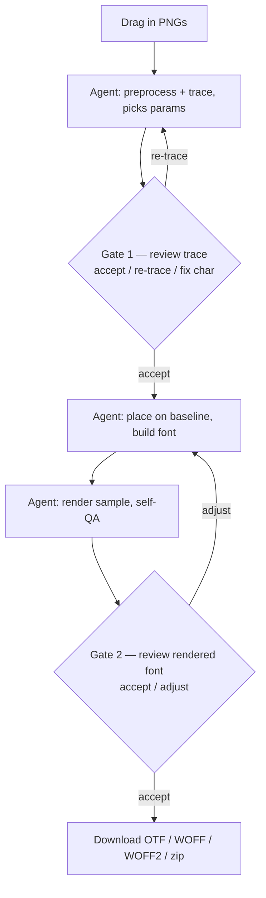
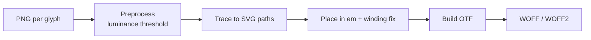
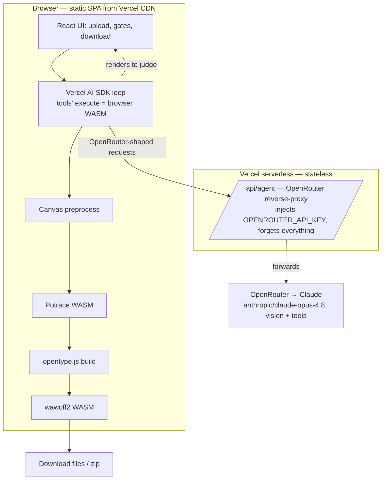

# Font Generator — Project Proposal

## Overview

This project is an **agentic, browser-based font generator** for custom typefaces
designed as individual letter images. You drag in PNG glyphs, an AI agent drives
the raster→vector→font pipeline while you approve at a couple of checkpoints, and
you download a standards-compliant font family (OTF master plus WOFF/WOFF2 for the
web).

The whole font pipeline runs **client-side in the browser** via WebAssembly. The
agent loop is driven by the **Vercel AI SDK** (also client-side) against **OpenRouter**
as the model gateway; the only server-side piece is a **thin, stateless proxy** that
injects the OpenRouter key. It is deployed as a **static site on Vercel**.

The tool handles the full pipeline that turns raster artwork into real font files:

1. **PNG in** — one image per glyph
2. **Preprocess** — key out the background by luminance; produce a clean bilevel bitmap
3. **Trace to SVG** — bitmap silhouettes become vector paths
4. **Assemble the font** — paths, metrics, and Unicode mappings become a single typeface
5. **Export** — downloadable **OTF**, **WOFF**, and **WOFF2** (optionally zipped)

Two things define v1's shape:

- **Agentic, not a control panel.** Instead of a UI full of trace sliders and
  metric fields, an AI agent (Claude, with vision) *chooses* the parameters and
  *visually QAs* its own output. The human approves or rejects at two gates. This
  trades determinism for far less UI/wiring code — see *Agentic Pipeline*.
- **Stateless and ephemeral.** No accounts, no database, no saved projects.
  Drag → churn → download → done; a refresh wipes everything. Same feel as a
  HuggingFace Space preview.

> This is the productized counterpart to the CLI reference in
> [claude-process.md](./claude-process.md). That doc uses native tools (Potrace,
> FontForge) to prove the pipeline is correct; this app uses their WASM/JS
> equivalents so everything runs in the browser on Vercel.

---

## What We're Building

### Problem

Designers often create custom letterforms as image files (PNG exports from
Procreate, Illustrator, scans, etc.). Turning those into installable or web-ready
fonts usually means manual work in FontForge, Glyphs, or similar tools — tracing,
spacing, winding correction, and exporting formats by hand. Even the "automated"
tools push a wall of knobs (threshold, smoothing, side bearings) onto the user.

### Solution

A web app that:

- Accepts PNG glyph images via drag-and-drop or file picker
- Runs an **agent** that picks preprocessing/trace parameters, assigns each glyph a
  character, places it on a shared baseline, and **looks at its own render** to
  catch filled counters, upside-down glyphs, and baseline errors
- Presents **two human accept/reject gates** — after tracing, and after the font is
  built and rendered — with natural-language re-tries ("sharper corners", "sits too
  low") instead of sliders
- **Generates and downloads** OTF (master), plus WOFF and WOFF2 for the web
- Runs the font work **entirely in the browser**; only renders the agent must *see*
  leave the machine (to the model, via the stateless proxy)

### Target workflow

### Core features (v1)

| Feature | Description |
|---------|-------------|
| Glyph upload | Single or batch PNG upload with thumbnails |
| Agentic pipeline | Agent picks threshold/trace params, assigns characters, places glyphs, self-QAs via vision |
| Character assignment | Agent *proposes* the character (it can read the glyph); human confirms at Gate 1 |
| Two review gates | Gate 1 (traced vector over original) and Gate 2 (font rendered) — accept / reject / natural-language nudge |
| Deterministic mechanics | px→em transform, winding correction, WOFF2 wrapping run as fixed WASM/JS tools (not agent guesswork) |
| Reproducible runs | The agent logs the exact parameters it chose (a "recipe") so a good run can be replayed |
| Live preview | Sample text rendered with the in-progress font via blob URL |
| Export | OTF as master; derive WOFF and WOFF2; optional zip bundle |

### Explicitly deferred (post-v1)

- Accounts, saved projects, cloud persistence — **permanently out** for the stateless v1
- Kerning editor and pair adjustments
- Multiple weights/styles in one family (Bold, Italic, etc.)
- A fully manual "expert mode" control panel (sliders for every knob) — the agent
  replaces it; may return later as an escape hatch
- Desktop app (Tauri/Electron) with filesystem watch
- Color/font layers (COLR/CPAL, SVG-in-OTF)

---

## Agentic Pipeline

The core design decision: **the agent replaces the manual control surface, not the
deterministic math.** Most of a traditional font-generator UI (trace sliders, metric
fields, validation warnings, per-glyph overrides) exists so a *human* can supply
judgment the code can't. A vision-capable agent supplies that judgment directly, so
we delete the control panel and keep a thin review UI.

### The split — brain vs. hands

| Deterministic tools (the hands) | Agent judgment (the brain) |
|---|---|
| `preprocess(png, {threshold, close})` → bilevel + preview | *Pick* the threshold by looking at the image |
| `trace(bitmap, {turdsize, alphamax, opttolerance})` → paths + preview | *Pick* trace params; judge if corners/counters came out right |
| `buildFont(glyphs, {unitsPerEm, baselineFraction, family})` → OTF bytes | *Choose* baseline/side bearings; assign the character |
| `renderSample(font, text)` → PNG | **Look at the render**; spot filled counters, flips, wrong baseline |
| `validate(font)` → OTS/round-trip report | Decide whether to accept a stage or re-run it |

The mechanical transforms — px→em scaling, the baseline math, winding correction,
WOFF2 wrapping — are exact arithmetic and stay deterministic. The agent only does
the two things it is uniquely good at: **choosing parameters from an image** and
**visually QA'ing output.**

### The loop and the two gates

The agent runs a tool-use loop (choose params → run tool → look at result →
adjust or advance). Human review is intentionally sparse — two gates:

1. **Gate 1 — after trace.** Show the traced vector over the original PNG plus the
   agent's proposed character. Actions: *Accept*, *Re-trace* (with a plain-language
   nudge), or *Fix character*.
2. **Gate 2 — after build + render.** Show the sample text rendered in the built
   font, plus validation status. Actions: *Accept & export*, or *Adjust*.

Everything between the gates the agent handles and self-corrects silently.

### Reproducibility

Agentic ≠ unrepeatable. The agent records every parameter it chose per glyph (a
JSON "recipe"). You give up *guaranteed* up-front determinism but keep
**replayability** — any run you liked can be pinned and re-executed with identical
parameters. This removes the only real downside of the non-deterministic approach.

---

## Technical Pipeline

A font file is not a zip of images. Each glyph needs a **Unicode mapping**, a
**vector outline**, and **metrics** (advance width, side bearings, baseline
alignment). The pipeline below produces proper outline fonts; the agent drives it,
the tools do the deterministic work.

### Step 1 — PNG input

- Any background — the app keys out the background by **luminance**, so solid
  backgrounds (e.g. the cream in `A-KaminoDeco.png`) work as well as transparency
- High-contrast silhouettes trace best
- Consistent source resolution helps; the app normalizes to a shared em-box

### Step 2 — Preprocess (luminance-first)

- **Threshold on luminance** so background → white, ink → solid black (this is the
  default, not a fallback — the first real asset has a cream background, not alpha)
- Remove anti-aliased grey edge pixels (they become jagged micro-contours if traced)
- Crop **horizontally** to ink bounds only; keep the vertical frame shared (see
  *Glyph Geometry*)

### Step 3 — PNG → SVG (tracing)

- **Potrace (WASM)** as the default tracer for letterform silhouettes
- Agent tunes `turdsize` (speckle removal), `alphamax` (corner sharpness — kept
  high to preserve crisp apexes/feet), `opttolerance` (curve fit)
- Output: Bézier paths — outer outline plus counters

### Step 4 — SVG → font glyphs

- Map each path set to a Unicode code point
- Apply the shared px→em transform (scale + baseline); run the winding-correction pass
- Set per-glyph advance width and side bearings
- Assemble into a single font with family metadata

### Step 5 — Export formats

| Format | Role |
|--------|------|
| **OTF** | Master format — desktop apps, design tools |
| **WOFF** | Web delivery (older browser support) |
| **WOFF2** | Web delivery (modern standard, better compression) |

OTF is built first; WOFF and WOFF2 are **compressed wrappers** derived from it at
export time (same SFNT tables, fewer bytes).

---

## Glyph Geometry & Metrics

Different letters are different heights: `x` fills only the mid-band, `b` reaches
up, `g` and `p` drop below the line. The mistake to avoid is normalizing each PNG to
*fill* the em-square independently — that flattens every glyph to the same size and
stacks them on the same edge, producing an unusable font.

Instead, **all glyphs share one image→em transform** (a single scale plus a single
baseline offset). A glyph is small in the font because its ink occupies less of the
shared frame — not because we shrank it. With scale and baseline shared, correct
relative sizing and a common baseline fall out for free, descenders included.

### v1 default — uniform capture frame

Glyphs are authored on a common canvas with the baseline in a consistent place. The
app maps the full canvas height to the em and applies the same transform to every
glyph:

- `unitsPerEm = U` (e.g. 1000)
- baseline at fraction `b` of canvas height from the top → baseline pixel row `b·H`
- scale `s = U / H` (px → font units, identical for all glyphs)
- a source pixel at row `r` (0 at top) → font `y = (b·H − r) · s`

Because `s` and `b` are the same for every glyph, the baseline row maps to `y = 0`
everywhere; ink above is positive, descenders below are negative. The font's vertical
metrics derive from the same knobs: `ascender = b·U`, `descender = −(1 − b)·U`. Two
global controls (`unitsPerEm`, baseline fraction) drive the whole set.

- **Vertical:** shared frame — do *not* crop vertically (cropping discards the baseline reference).
- **Horizontal:** crop to ink bounds per glyph, then `advance width = ink width + left/right side bearings`, so spacing is proportional rather than monospaced.

### Escape hatch (Polish step)

A per-glyph vertical nudge/scale override for glyphs that don't follow the capture
convention. The shared frame stays the default; overrides are the exception, and are
exactly the kind of judgment the agent can propose at a gate.

### Synthesized glyphs

Generated automatically, since users won't upload them:

- **`.notdef`** (glyph 0) — required by the format
- **space** — no outline, but a real advance width

### Contour winding

Letters with counters (`A`, `o`, `a`, `e`, `p`) need the hole to wind opposite to the
outer contour, or CFF's non-zero fill paints the counter solid. Potrace's fill model
isn't guaranteed to match, so the SVG→glyph step includes a winding-correction pass.
(The `A` in `A-KaminoDeco.png` has exactly this enclosed counter.)

---

## Statelessness & Privacy

v1 is deliberately ephemeral, HuggingFace-Space-style:

- **No database, no accounts, no saved projects.** All state lives in browser memory
  (a Zustand store). A refresh wipes it — the app is one pass from drop to download.
- **The font pipeline never leaves the browser.** Preprocess, trace, build, and
  WOFF2 wrapping all run client-side in WASM/JS. The PNG and the font bytes are never
  uploaded for the *conversion*.
- **Only what the agent must see leaves the machine.** The agent needs to look at
  renders to judge them, so those images (and the agent's text) go to the model via
  the stateless proxy. This is the one privacy trade the agentic design makes, and
  it's named explicitly rather than discovered later.
- **The proxy holds nothing.** It forwards a single model turn and forgets it — no
  logging of image content, no persistence.

---

## Architecture

Static SPA on Vercel's CDN + one stateless serverless function. The browser
orchestrates the agent loop; each model turn is a short, independent function
invocation (which keeps every call well under Vercel's per-invocation time limit).

### The agent loop (Vercel AI SDK, client-side)

The **Vercel AI SDK** (`ai` package + `@openrouter/ai-sdk-provider`) runs the agent
loop **in the browser**, so each pipeline tool's `execute` runs right where its WASM
lives — no need to hand-roll the tool-use loop:

1. `streamText`/`Agent` is configured with the OpenRouter provider and our tools
   (`tool({ inputSchema, execute })`, where `execute` is the WASM function).
2. `stopWhen: stepCountIs(N)` runs the multi-step loop: model turn → the SDK calls the
   requested tool's `execute` in the browser → appends the result → next turn.
3. A `requestGate` tool pauses the loop and hands control to the human; the loop ends
   on completion.

The provider's `baseURL` points at our proxy, so model calls are the only thing that
leaves the browser. Each model turn is a short call → stays under Vercel's
per-invocation limit; the loop and all tool execution stay client-side.

### Key handling

- **Default (hosted):** `createOpenRouter({ baseURL: "/api/agent" })` in the browser;
  the Vercel function is a thin **reverse-proxy** that injects `OPENROUTER_API_KEY`
  (Authorization header) and forwards to OpenRouter. Stateless — nothing stored. The
  key never touches client code even though the loop and tools run client-side.
- **Optional (BYO-key):** the user supplies their own OpenRouter key. It routes through
  the same proxy for that call only (never bundled, never stored) — or the browser
  calls OpenRouter directly *if* CORS permits (unverified; the proxy path always works).

### UI modules (conceptual — deliberately thin)

1. **Upload** — drop zone, batch import, thumbnails
2. **Run view** — streamed agent steps, current stage, the two gates
3. **Preview** — sample text rendered with the in-progress font
4. **Export** — format selection and download

Notably absent versus a traditional design: no trace-controls panel, no per-glyph
metric fields, no validation-warning list. The agent owns those.

---

## Proposed Stack

### Guiding principles

- **Stateless & ephemeral** — no DB, no accounts; refresh = fresh
- **Browser-first compute** — the whole font pipeline runs client-side in WASM/JS
- **Agent for judgment, code for mechanics** — vision-driven params + QA; deterministic transforms
- **Static deploy on Vercel** — CDN-served SPA + one stateless function
- **TypeScript** — type safety across tracing, font math, agent tool contract, UI state

### Frontend

| Choice | Role |
|--------|------|
| **Vite** | Build tooling, fast dev server |
| **React** | UI: upload, run view + gates, preview, export |
| **TypeScript** | Shared types for glyphs, metrics, the agent tool contract |
| **Zustand** | Ephemeral in-memory state (glyphs, params, recipe) — nothing persisted |
| **Tailwind CSS** | Layout and styling |

### Processing libraries (all client-side)

| Choice | Role |
|--------|------|
| **Canvas API** | Luminance threshold + crop (preprocess) |
| **Potrace (WASM)** | PNG → SVG path tracing (e.g. `esm-potrace-wasm`) |
| **opentype.js** | Assemble glyphs into OTF; tables, cmap, metrics; winding correction |
| **wawoff2 (WASM)** | OTF → WOFF2 (WASM build of Google's woff2) |
| **JSZip** | Bundle `.otf`, `.woff`, `.woff2` into one download |

### Agent

| Choice | Role |
|--------|------|
| **OpenRouter** | Model gateway — one key, many multimodal models. Slug `anthropic/claude-opus-4.8` (dots, not the native dashes), `anthropic/claude-sonnet-5` as the cheaper fallback |
| **Vercel AI SDK** (`ai` + `@openrouter/ai-sdk-provider`) | Client-side agent loop: `tool({inputSchema, execute})`, `stopWhen: stepCountIs(N)`; each tool's `execute` = browser WASM |
| **Reasoning + caching** | `providerOptions.openrouter.reasoning: {effort:"high"}` (maps to native effort; thinking is adaptive-only on 4.8, a fixed token budget is ignored); `providerOptions.openrouter.cacheControl: {type:"ephemeral"}` on the stable prefix |
| **Vercel serverless function** | Stateless `/api/agent` reverse-proxy — injects `OPENROUTER_API_KEY`, forwards each call |

### Testing

| Choice | Role |
|--------|------|
| **Vitest** | Unit tests: px→em transform, metrics helpers, winding, tool wrappers, font round-trip parse |
| **Playwright** (later) | End-to-end: upload → agent run → export smoke test |

---

## Alternatives Considered

### Deterministic control-panel app (the original v1 idea)

- **Pros:** fully deterministic, no model dependency, no data leaves the machine
- **Cons:** large UI surface (trace sliders, metric fields, validation lists, per-glyph
  overrides) — the exact wiring the agentic approach deletes; pushes judgment onto the user
- **When:** if model cost/latency or availability becomes unacceptable, or as an
  "expert mode" escape hatch layered under the agent

### Native tools on a server (FontForge / Potrace binaries)

- **Pros:** FontForge collapses build+export into one step; most capable tooling
- **Cons:** native binaries **can't run on Vercel** (serverless is a JS sandbox);
  would require a different host and a real server
- **When:** used only in the CLI reference path ([claude-process.md](./claude-process.md)),
  not the deployed product

### Fully client-side, zero server (no proxy)

- **Pros:** the most Vercel-native, truly serverless form
- **Cons:** an API key can't be safely embedded in client code
- **When:** viable as **BYO-key** mode, where the user supplies their own key

---

## Open Decisions

| Question | Proposed default |
|----------|------------------|
| Stateless / ephemeral for v1? | Yes — no DB, no accounts, refresh = fresh |
| Hosted proxy vs BYO-key? | Ship hosted proxy; add BYO-key as an option |
| Agent model | `anthropic/claude-opus-4.8` via OpenRouter; `anthropic/claude-sonnet-5` as the cheaper fallback |
| Number of human gates | Two (post-trace, post-build) |
| Glyph sizing model | Shared capture frame (uniform canvas + baseline fraction); per-glyph override via agent |
| Reproducibility | Log the agent's chosen params as a replayable recipe |
| Minimum glyph set for export | Allow partial fonts; agent warns about missing common characters |

---

## Suggested Implementation Order

1. **Scaffold** — Vite + React + TypeScript + Tailwind; deploy an empty SPA to Vercel
2. **WASM pipeline** — wire up Canvas preprocess, Potrace, opentype.js, wawoff2 as
   plain deterministic functions; unit-test the px→em transform + winding on the `A`
3. **Manual (no-agent) happy path** — one glyph → OTF → render → download, driven by
   hardcoded params, to prove the tools end to end
4. **Agent proxy** — stateless `/api/agent` Vercel function; browser-orchestrated
   tool-use loop against the WASM tools
5. **Gates** — Gate 1 (trace review) and Gate 2 (font review) with accept/reject/nudge
6. **Full export** — WOFF/WOFF2 derivation, zip bundle, recipe logging
7. **Polish** — batch upload, streamed agent narration, partial-font warnings, BYO-key mode

---

## Summary

We are building an **agentic, stateless font generator** that turns PNG letter images
into real **OTF / WOFF / WOFF2** files. The entire font pipeline runs **client-side in
the browser** (Canvas, Potrace-WASM, opentype.js, wawoff2), deployed as a **static
Vercel site**; the only server-side piece is a **thin stateless proxy** that injects
the OpenRouter key. A **Claude agent** (`anthropic/claude-opus-4.8` via OpenRouter,
driven by the client-side **Vercel AI SDK**) chooses preprocessing and trace
parameters and visually QAs its own output, while a human approves at **two gates**. This deletes the manual control-panel UI, keeps the font
math deterministic, and preserves privacy for everything except the renders the agent
must see. The detailed build spec is in [product-blueprint.md](./product-blueprint.md).
